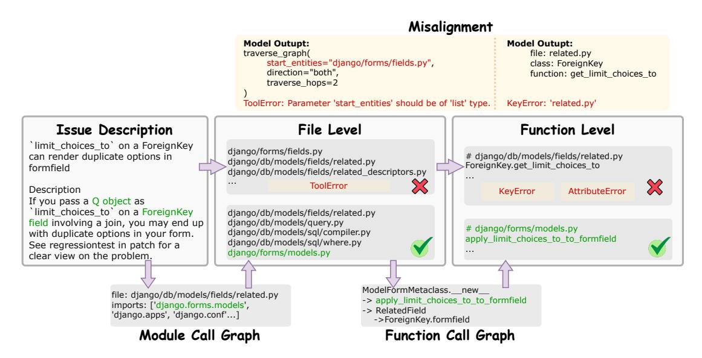
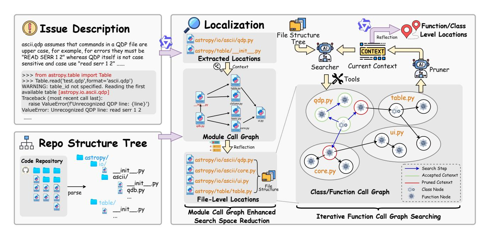
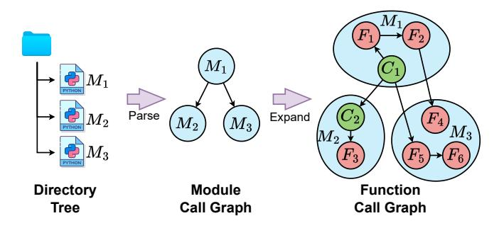
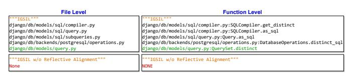

# Issue Localization via LLM-Driven Iterative Code Graph Searching

Zhonghao Jiang<sup>†</sup>, Xiaoxue Ren<sup>†</sup>, Meng Yan<sup>‡</sup>, Wei Jiang<sup>§</sup>, Yong Li<sup>§</sup>, Zhongxin Liu<sup>†\*</sup>

<sup>†</sup>The State Key Laboratory of Blockchain and Data Security, Zhejiang University, Hangzhou, China <sup>‡</sup>School of Big Data and Software Engineering, Chongqing University, Chongqing, China <sup>§</sup>Ant Group, Hangzhou, China

Emails: {zhonghao.j, xxren, liu\_zx}@zju.edu.cn, mengy@cqu.edu.cn, {jonny.jw, liyong.liy}@antgroup.com

Abstract—Issue solving aims to generate patches to fix reported issues in real-world code repositories according to issue descriptions. Issue localization forms the basis for accurate issue solving. Recently, large language model (LLM) based issue localization methods have demonstrated state-of-the-art performance. However, these methods either search from files mentioned in issue descriptions or in the whole repository and struggle to balance the breadth and depth of the search space to converge on the target efficiently. Moreover, they allow LLM to explore whole repositories freely, making it challenging to control the search direction to prevent the LLM from searching for incorrect targets. Meanwhile, because LLMs may not correctly produce the required interaction formats with the environment, they suffer from search failures.

This paper introduces CoSIL, an LLM-driven, powerful function-level issue localization method without training or indexing. To balance search breadth and depth, CoSIL employs a twophase code graph search strategy. It first conducts broad exploration at the file level using dynamically constructed module call graphs, and then performs in-depth analysis at the function level by expanding the module call graph into a function call graph and executing iterative searches. To precisely control the search direction. CoSIL designs a pruner to filter unrelated directions and irrelevant contexts. To avoid incorrect interaction formats in long contexts, CoSIL introduces a reflection mechanism that uses additional independent queries in short contexts to enhance formatted abilities. Experiment results demonstrate that CoSIL achieves a Top-1 localization accuracy of 43.3% and 44.6% on SWE-bench Lite and SWE-bench Verified, respectively, with Owen2.5-Coder-32B, average outperforming the state-of-the-art methods by 96.04%. When CoSIL is integrated into an issuesolving method, Agentless, the issue resolution rate improves by 2.98%-30.5%.

#### I. INTRODUCTION

Recently, issue solving [1], [2] has become a crucial task as it directly addresses bugs [3]–[5] and feature requests [6], [7] in real-world code repositories, thereby improving software quality and ensuring the continuous evolution of repositories. Given an issue in a repository, issue-solving methods aim to generate a patch according to the issue description provided by users. Accurate localization is the foundation for successfully resolving issues [8]. It aims to search for a set of suspicious code snippets within a certain scope of code files (i.e., search space) of the code repository.

LLM-based methods [9]–[12] have become the main force in issue localization tasks. Existing LLM-based issue localization methods can be mainly divided into prompt-based methods and agent-based methods. They face the following common challenges. O They fail to balance the breadth and depth of the search space. Prompt-based methods [9], [13] use the issue description and employ a hierarchical strategy to gradually converge to the target. However, issue description usually describes the symptoms rather than the essence of the problem [14], resulting in an overly narrow search space and causing relevant context to be ignored. Agent-based methods [10], [11], [15] leverage the code understanding capability of LLMs to freely explore the entire repository, which results in an overly broad search space and leads to the retrieval of irrelevant context. Irrelevant context interferes with useful information, leading to performance degradation. 2 They lack control of the search direction. Prompt-based methods often use as much context as possible from the search space without verifying its relevance. This causes the LLM to explore some search directions yet unrelated to the issue, making it difficult to locate the correct target. Agent-based methods directly depend on agents to decide search direction, which often rely only on the current state and lack a global perspective [16]. As a result, the agent may repeatedly explore the same code segments, leading to chaotic search directions. Additionally, as the agent bases its subsequent decisions on historical feedback from the environment, chaotic search directions can propagate, resulting in redundant noise in the context and degrading the performance of issue localization. **3** They produce abnormal search processes due to incorrectly formatted interaction outputs. LLM-based methods interact with the external environment (e.g., tool calling) via formatted outputs from the LLM [15], [17]. Prompt-based methods rely entirely on the LLM's inherent capabilities, which directly treat outputs with incorrectly formatted interactions as localization failures [9], [13], resulting in empty lists in the localization results. Agentbased methods typically add retry mechanisms, but the error messages produced by incorrectly formatted interactions are also included in the context [11]. As consecutive retries fill the context with error messages, they interfere with localization performance. Thus, the limited capability of LLMs to follow

<sup>\*</sup> Corresponding author.



<span id="page-1-0"></span>Fig. 1. A motivating example of Django-13315.

instructions for formatted output in long-context settings [\[18\]](#page-11-2) becomes a performance bottleneck.

To overcome the challenges above, we propose COSIL, an LLM-driven issue localization technique through iterative code graph searching. To balance the breadth and depth of the search space, we adopt a two-stage search strategy that performs broad exploration at the file level and indepth analysis at the function level. Specifically, we provide the LLM with a module call graph to expand the search space beyond the files mentioned in the issue description, enabling the identification of additional suspicious modules. By further expanding the module call graph into a function call graph and performing an iterative search, we collect highly relevant contextual information in greater depth. To control the search direction, we design a pruner that rejects the LLM's exploration of irrelevant context. This ensures the effectiveness of the collected contextual information and filters out contextual noise. Given LLMs exhibit stronger instructionfollowing capabilities in short-context settings [\[18\]](#page-11-2), we leverage a reflection mechanism [\[19\]](#page-11-3) that summarizes decision information into a short context to prevent the abnormal interaction format through enhancing LLM's formatted outputs. It involves performing an additional, independent query at the end of each LLM interaction to double-check and format the final output.

We implement COSIL based on Qwen2.5-Coder-7B/14B/32B [\[20\]](#page-11-4), and evaluate its effectiveness on SWEbench Lite [\[1\]](#page-10-0) and SWE-bench Verified [\[21\]](#page-11-5). Experimental results show that, compared to existing LLM-based issue localization methods, COSIL average improves Top-1 localization accuracy by 6.61% at the file level and by 96.04% at the function level. Furthermore, when leveraging the localization results generated by COSIL is integrated into an issue-solving method, Agentless [\[9\]](#page-10-7), the issue resolution rate increases by 2.98%–30.5%, further demonstrating the usefulness in application scenarios. In addition, we conduct an ablation study on the key components of COSIL, i.e., reflective alignment, module call graph, iterative search, and pruning. The results demonstrate the effectiveness of COSIL's key components: iterative search as the core, call graphs for search space constraint, pruning for search direction management, and reflective alignment for ensuring interaction format. Finally, we evaluate COSIL on different families of LLMs and compute its cost. Results show that it can generalize with a cost of 0.02\$ and 0.34\$ on DeepSeek-v3-0324 [\[22\]](#page-11-6) and GPT-4o-2024-0806 [\[23\]](#page-11-7).

In summary, our main contributions are as follows:

- We propose COSIL, an LLM-driven function-level issue localization method without training or pre-indexing. It balances the breadth and depth of the search space while ensuring the accuracy of the search direction and the correct interaction formats.
- We conduct extensive and comprehensive experiments on SWE-bench Lite [\[1\]](#page-10-0) and SWE-bench Verified [\[21\]](#page-11-5). Experiment results show that COSIL achieves up to 48% Top-1 accuracy in function-level localization, nearly twice that of existing methods. It brings an average performance improvement of 14.90% on the issue-solving task.
- We open-source the replication package, including the source code and data of COSIL, at [https://github.com/](https://github.com/ZJU-CTAG/CoSIL) [ZJU-CTAG/CoSIL.](https://github.com/ZJU-CTAG/CoSIL)

#### II. MOTIVATION AND BACKGROUND

#### *A. Motivating Example*

Figure [1](#page-1-0) presents a motivating example, which is an issue collected from the Django repository.

This example describes a phenomenon where passing a "*Q Object*" to the "*limit\_choices\_to*" parameter of a "*ForeignKey Field*" results in duplicate options appearing in the form. We inspect the results produced by three state-of-the-art issue



<span id="page-2-0"></span>Fig. 2. Overview of COSIL.

localization methods, i.e., Agentless [\[9\]](#page-10-7), OrcaLoca [\[10\]](#page-10-11), and LocAgent [\[11\]](#page-10-12), using Qwen2.5-Coder-32B model. None of them successfully find the correct location to edit.

We analyze their trajectories when handling this case and summarize three major observations. ❶ The three methods are limited in search breadth or depth. Specifically, Agentless extracts targeted file names mentioned in the issue description [\[9\]](#page-10-7), including "django/forms/fields. py" and "django/db/models/fields/related.py". While these files are related to the issue, they are not the ones that require modification. Conducting function-level localization within such a narrow search space makes it nearly impossible to identify the correct function to edit. In contrast, OrcaLoca searches by analyzing the frequency with which the LLM focuses on each function [\[10\]](#page-10-11). But the most frequently referenced function, "*ForeignKey.get\_limit\_choices\_to*", may only be textually similar to the issue description but semantically irrelevant, searching in such an overly broad space as the entire repository is not feasible. ❷ These methods lack control of search directions. Specifically, when LocAgent uses the "*search\_code\_snippets*" tool to read code snippets, both the first and third actions inspect the source code of "*ForeignKey*", resulting not only in redundant context but also in an unordered search process. ❸ Incorrectly formatted outputs during interactions lead to the three methods crashing. Specifically, when LocAgent [\[11\]](#page-10-12) calls the "*traverse\_graph*" tool, where the LLM passes an argument with an incorrect type for the parameter "*start\_entities*", it not only fails to retrieve context, but also includes detailed error messages of this "*ToolError*". Moreover, when these three methods feed back the decided locations, the localization may fail because unformatted output cannot be parsed. For example, Agentless [\[9\]](#page-10-7) might output an incomplete file path, leading to a "*KeyError*" and ultimately a failed localization attempt.

From observation 1, we find that when the search space is too narrow, existing techniques cannot find the target within a space that excludes the correct one. When the search space is too broad, existing techniques may retrieve irrelevant targets that are only textually similar. This motivates a two-phase strategy to balance the search space, i.e., expanding the search breadth at the file level through the module call graph while maintaining search depth through function call graphs. From observation 2, we find that if the search direction is not restricted, the limited context window becomes populated with substantial redundant or unrelated content, leading to inefficiency. This motivates us to prune the irrelevant context to control the search directions. From observation 3, we find that incorrect output format during the LLM's interaction with the environment not only pollutes the context with irrelevant information but can even derail the localization process entirely. Motivated by the fact that LLM alignment degrades in long-context settings [\[18\]](#page-11-2), [\[24\]](#page-11-8), we integrate self-reflection [\[19\]](#page-11-3) as a verifier to double-check and correct final decisions.

#### *B. Call Graph Construction*

As the call graphs in the repository typically describe the invocation and dependency relationships among modules at the class/function level, we can use them to expand the search space at a coarse granularity and to constrain the search space at a fine granularity.

In this work, we mainly use two types of call graphs: module call graphs and function call graphs. Given a code repository R, the module call graph is defined as GM(R) = (Vm, Em), where V<sup>m</sup> consists of all modules in R, and E<sup>m</sup> includes all "import" relationships between modules. Furthermore, each node in V<sup>m</sup> can be expanded into multiple class/function nodes. Based on this, the function call graph # Import Relations

ile: full\_file\_path/file1.py imports: ['import\_file1', 'import\_file2'...]

file: full\_file\_path/file2.py imports: ['import\_file3', 'import\_file4'...]

#### # Function Call Relations

function: target\_func1 static\_functions:['file1:s\_func1', 'file2:s\_func2'...] class\_functions:['file1:class1.func1'...]

function: target\_func2 static\_finctions:['file3:s\_func3']

<span id="page-3-2"></span>Fig. 3. Textual representation of call graphs.

can be defined as  $\mathcal{G}_F(R) = (\mathcal{V}_f, \mathcal{E}_f)$ , where  $\mathcal{V}_f$  consists of all the classes and functions defined in  $\mathcal{V}_m$ .  $\mathcal{E}_f$  includes all "invoke" and "inherit" relationships between classes and functions. We use the LLM to construct the necessary call graph dynamically in a textual representation. Specifically, we provide the LLM with the code of the module/function and its import statements parsed from the files where they are located, prompting the LLM to analyze their outgoing dependency and generate a first-order subgraph centered on the target module/function. An example of the call graph and the detailed construction algorithm through LLMs can be found in our online Appendix-A.

#### III. APPROACH

In this section, we introduce CoSIL, an LLM-driven issue localization framework. As shown in Figure 2, CoSIL takes an issue description and a repository structure tree extracted from the original code repository as inputs and returns a recommendation list containing the signatures of the most suspicious functions. It consists of two stages, i.e., module call graph enhanced search space reduction at the file level and iterative function call graph searching at the function level.

To ensure that the search space is not limited and avoid an overly broad scope that includes the entire repository, CoSIL expands the search space from the modules mentioned in the issue description to imported modules by providing the LLM with the module call graph during the file-level stage (Section III-A1). To collect context and perform an in-depth search, CoSIL uses a specifically designed search tool to iteratively explore the function call graph at the function-level stage (Section III-A2). Additionally, to achieve a balance between context length and the density of relevant information, CoSIL utilizes a pruning mechanism to control the search direction and prevent irrelevant context from being retrieved (Section III-B). To enhance the LLM's ability to produce formatted outputs when interacting with the external environment, CoSIL leverages reflection at the end of each stage, thereby alleviating parsing errors in the final results (Section III-C).

#### A. Localization with Call Graph

<span id="page-3-0"></span>1) Module Call Graph Enhanced Search Space Reduction: This stage takes the repository structure tree as input and returns a list of suspicious files as the search space. Because of the limited context window size of LLMs, directly providing the code in all files to the model is often infeasible. Inspired by previous studies [9], [13], we recursively traverse the entire repository and parse it into a hierarchical repository-structure tree representation. Considering that most issue reports contain

TABLE I
DESIGN OF SEARCH TOOLS.

<span id="page-3-3"></span>

| <b>Function Name</b>                            | Description                                                                                    |
|-------------------------------------------------|------------------------------------------------------------------------------------------------|
| search_class_node<br>search_class_function_node | Get the code snippet of a class node.<br>Get the code snippet of a class member function node. |
|                                                 | Get the code snippet of a static function node.                                                |
| exit                                            | Terminate iteration search and go into summary phase.                                          |

information about candidate suspicious locations [25], we query LLM with the issue description to pre-select the related files The prompt template can be found in Appendix-E. Then, the "import" statements in the related files are parsed to construct a first-order subgraph of the module call graph, which starts from the related files. Such a subgraph is then converted into structured textual representations, as shown in Figure 3. Next, the pre-selected related files, along with the repository-structure tree and the module call graph, are fed into the LLM for search space expansion, enabling the reselection and reranking of the suspicious files. The rationale behind not utilizing the entire module call graph is that the repository-structure tree already provides a comprehensive view of the repository.

<span id="page-3-1"></span>2) Iterative Function Call Graph Searching: This stage takes the file-level search space as input and returns a list of suspicious functions. Specifically, it consists of the following three steps. (**Detailed algorithm is in Appendix-B**)

**Step I: Initialize the search state.** This step aims to preliminarily determine one or several starting points for the search. Specifically, similar to the repository-structure tree described in Section III-A1, we construct a file-structure tree for all suspicious files, outlining all classes, member functions, and static functions within these files in a hierarchical format. Then we provide the issue description along with this file-structure tree as inputs to query the LLM to return selected points.

Step II: Iterative search contexts. This step aims to collect contextual information for locating suspicious functions. First, we construct a search agent by equipping the LLM with retrieval tools as shown in Table I and a pruner agent (detailed in Section III-B) by providing a function code snippet and asking for a boolean flag indicating if the code snippet should be used as context. Then, we set a maximum number of iterations to prevent the search agent from falling into an infinite loop. During each iteration step, the search agent first selects a target node from the set of accessible nodes (denoted as visableNodes) for exploration according to the issue description and the visited nodes (denoted as contextNodes). The target node could refer to a class, a class member function, or a static function. Depending on the type of the target node, the search agent invokes different search tools shown in Table I to retrieve node content. Next, the retrieved code will be verified by the pruner agent, which determines whether the target node is acceptable. Once the target node is confirmed and accepted by the pruner agent into contextNodes, its neighbor nodes within the function call graph become accessible and are added to the visableNodes for selection in subsequent iterations. Notably, if the search agent returns an incorrect function-call parameter, i.e., the search agent would like to retrieve non-existent code elements, a post-processing procedure will prompt the search agent to reselect the node from the accessible nodes for exploration. Additionally, if the search agent invokes the "exit" tool, which means that sufficient information has been collected to support a decision, the iteration process will be terminated prematurely.

Step III: Summarize the suspicious functions. This step aims to select and rerank a set of the most suspicious functions or classes from the context nodes generated by Step II. Specifically, the search agent incorporates the retrieved code snippets from relevant context nodes into a summarization prompt as the background knowledge for in-context learning. Then, LLM returns a list of suspicious functions as localization results. The summarized function-level localization information can either be utilized for further fine-grained line-level localization or provided as contextual input to the LLM for subsequent program repair directly.

#### <span id="page-4-0"></span>*B. Context Management with Pruning*

This component takes the issue description and code snippet to be explored by the search agent as input and returns a boolean flag indicating whether the node should be accepted. Specifically, when LLM selects a target node, the code snippet of the node is used as context to construct a prompt that instructs the LLM to analyze whether the node is related to the issue being addressed, and the LLM is asked to return a boolean value. If the pruner agent returns a "True" flag to accept this node as part of the context, its neighboring nodes will subsequently be expanded. Otherwise, the pruner directly rejects the expansion and excludes the node from the context, effectively pruning the search path.

By pruning the search path, COSIL effectively guides the search direction, encouraging the LLM to explore suspicious functions to avoid getting stuck in local optima. Simultaneously, it enables efficient context management, preventing the agent from collecting excessive redundant information, which might lead to erroneous decision-making.

#### <span id="page-4-1"></span>*C. Reflective Alignment*

This component takes the last returned response by the LLM in Section [III-A1](#page-3-0) and Section [III-A2](#page-3-1) to rerank and reformat the output. It acts as a verifier to guard against incorrect interaction formats in long-context scenarios [\[18\]](#page-11-2).

Specifically, we maintain a message list to record each query and response during interactions with the LLM, and collect context through multiple queries. Since COSIL requires the LLM to summarize the suspicious locations in the final query round (Section [III-A1](#page-3-0) and [III-A2\)](#page-3-1), the last response in the message list should contain the LLM's decision information. Reflective Alignment takes the issue description together with the last response containing decision information as context, and prompts the LLM to rerank and reformat the candidate locations given in the decision information to obtain the final localization result. The detailed prompt can be found in [Appendix-](https://zenodo.org/records/15561104)E. Reflective Alignment is applied at the end of both file-level and function-level localization, significantly reducing localization failures caused by unstructured or improperly formatted outputs. It also retains the advantages of the reflection reasoning strategy [\[19\]](#page-11-3), and thus can correct and rerank the localization results.

#### IV. EXPERIMENT SETUP

#### *A. Dataset*

SWE-bench [\[1\]](#page-10-0) is the most widely used dataset for evaluating large language models' capabilities in solving real-world software issues. It extracts 2,294 tasks from 12 Python code repositories, where each task requires submitting a patch to solve an issue in the corresponding repository. To control experimental costs, we conduct experiments on two popular subsets of SWE-bench:

- SWE-bench Lite [\[1\]](#page-10-0) is a 300-instance subset selected using heuristic methods. It removes tasks where the issue description contains images, external hyperlinks, and other non-textual elements.
- SWE-bench Verified [\[21\]](#page-11-5) is a subset of 500 instances developed by OpenAI. It is selected from 1,699 manually annotated instances by professional developers and removes instances with underspecified descriptions or overly specific test cases.

#### *B. Baselines*

We mainly compare COSIL with open-source localization methods that focus on SWE-bench, including Agentless [\[9\]](#page-10-7), Orcaloca [\[10\]](#page-10-11), and LocAgent [\[11\]](#page-10-12).

- Agentless is the current state-of-the-art open-source issue solving pipeline. It is designed based on human prior knowledge and performs issue localization by hierarchically querying the LLM for suspicious files, functions, and code lines. We use the localization component in Agentless as the baseline, denoted as Agentless-FL.
- Orcaloca designs an LLM agent framework, which searches on a unique code graph based on priority scheduling, action decomposition, and relevance scoring. In addition, it employs distance-aware pruning on the retrieved context, enhancing the accuracy of fault localization.
- LocAgent parses all dependency relationships within the code repository and constructs a large graph index, enabling the LLM to locate relevant entities through multi-hop reasoning using retrieval tools.

Additionally, we consider the fine-tuning-based approach BugCerberus [\[12\]](#page-10-8), but fail in conducting the comparison because its implementation is not released.

#### *C. Research Questions (RQs)*

To evaluate the performance of COSIL under issue localization tasks, we consider the following research questions.

• RQ1. Effectiveness: How effective is COSIL in localizing buggy code snippets in the code repository?

TABLE II

LOCALIZATION RESULTS UNDER DIFFERENT LLMS ON SWE-BENCH LITE. ER INDICATES empty rate.

<span id="page-5-0"></span>

| Method                                        | File-level          |              |                                                                                         |              | Function-level                                                                                                                                                                                                                                                                                                                                                                                                                                                                                                                                                                                                                                                                                                                                                                                                                                                                                                                                                                                                                                                                                                                                                                                                                                                                                                                                                                                                                                                                                                                                                                                                                                                                                                                                                                                                                                                                                                                                                                                                                                                                                                                  |                                                                                   |                    |                                                                                        |                                                                                            |             |       |
|-----------------------------------------------|---------------------|--------------|-----------------------------------------------------------------------------------------|--------------|---------------------------------------------------------------------------------------------------------------------------------------------------------------------------------------------------------------------------------------------------------------------------------------------------------------------------------------------------------------------------------------------------------------------------------------------------------------------------------------------------------------------------------------------------------------------------------------------------------------------------------------------------------------------------------------------------------------------------------------------------------------------------------------------------------------------------------------------------------------------------------------------------------------------------------------------------------------------------------------------------------------------------------------------------------------------------------------------------------------------------------------------------------------------------------------------------------------------------------------------------------------------------------------------------------------------------------------------------------------------------------------------------------------------------------------------------------------------------------------------------------------------------------------------------------------------------------------------------------------------------------------------------------------------------------------------------------------------------------------------------------------------------------------------------------------------------------------------------------------------------------------------------------------------------------------------------------------------------------------------------------------------------------------------------------------------------------------------------------------------------------|-----------------------------------------------------------------------------------|--------------------|----------------------------------------------------------------------------------------|--------------------------------------------------------------------------------------------|-------------|-------|
| 11201104                                      | Top-1               | Top-3        | Top-5                                                                                   | MAP          | MRR                                                                                                                                                                                                                                                                                                                                                                                                                                                                                                                                                                                                                                                                                                                                                                                                                                                                                                                                                                                                                                                                                                                                                                                                                                                                                                                                                                                                                                                                                                                                                                                                                                                                                                                                                                                                                                                                                                                                                                                                                                                                                                                             | Top-1                                                                             | Top-3              | Top-5                                                                                  | MAP                                                                                        | MRR         | ER    |
|                                               | Qwen2.5-Coder-7B    |              |                                                                                         |              |                                                                                                                                                                                                                                                                                                                                                                                                                                                                                                                                                                                                                                                                                                                                                                                                                                                                                                                                                                                                                                                                                                                                                                                                                                                                                                                                                                                                                                                                                                                                                                                                                                                                                                                                                                                                                                                                                                                                                                                                                                                                                                                                 |                                                                                   |                    |                                                                                        |                                                                                            |             |       |
| Agentless-FL<br>OrcaLoca<br>LocAgent<br>CoSIL | <b>0.467</b> ↓12.2% | 0.490 17.7%  | 0.577 \(\gamma\)10.4%<br>0.490 \(\gamma\)30.0%<br>0.533 \(\gamma\)19.5%<br><b>0.637</b> | 0.478 10.3%  | 0.478 ↑4.6%                                                                                                                                                                                                                                                                                                                                                                                                                                                                                                                                                                                                                                                                                                                                                                                                                                                                                                                                                                                                                                                                                                                                                                                                                                                                                                                                                                                                                                                                                                                                                                                                                                                                                                                                                                                                                                                                                                                                                                                                                                                                                                                     | 0.173 †23.1%<br>0.157 †35.7%<br>0.047 †353.2%<br><b>0.213</b>                     | 0.273 <b>↑7.3%</b> | 0.270 \(\gamma\)13.7%<br>0.293 \(\gamma\)4.8%<br>0.160 \(\gamma\)91.9%<br><b>0.307</b> | 0.209 15.3%                                                                                |             | 8.33% |
|                                               | Qwen2.5-Coder-14B   |              |                                                                                         |              |                                                                                                                                                                                                                                                                                                                                                                                                                                                                                                                                                                                                                                                                                                                                                                                                                                                                                                                                                                                                                                                                                                                                                                                                                                                                                                                                                                                                                                                                                                                                                                                                                                                                                                                                                                                                                                                                                                                                                                                                                                                                                                                                 |                                                                                   |                    |                                                                                        |                                                                                            |             |       |
| Agentless-FL<br>OrcaLoca<br>LocAgent<br>COSIL | 0.433 ↑34.6%        | 0.477 ↑53.7% |                                                                                         | 0.455 ↑46.8% | 0.455 ↑44.6%                                                                                                                                                                                                                                                                                                                                                                                                                                                                                                                                                                                                                                                                                                                                                                                                                                                                                                                                                                                                                                                                                                                                                                                                                                                                                                                                                                                                                                                                                                                                                                                                                                                                                                                                                                                                                                                                                                                                                                                                                                                                                                                    | 0.187 <b>↑8.6%</b><br>0.170 <b>↑19.4%</b><br>0.090 <b>↑125.6%</b><br><b>0.203</b> | 0.303 ↑7.9%        | 0.313 12.8%                                                                            | 0.219 \(\gamma\)16.4\%<br>0.229 \(\gamma\)11.4\%<br>0.192 \(\gamma\)32.8\%<br><b>0.255</b> | 0.233 14.6% | 6.33% |
|                                               | Qwen2.5-Coder-32B   |              |                                                                                         |              |                                                                                                                                                                                                                                                                                                                                                                                                                                                                                                                                                                                                                                                                                                                                                                                                                                                                                                                                                                                                                                                                                                                                                                                                                                                                                                                                                                                                                                                                                                                                                                                                                                                                                                                                                                                                                                                                                                                                                                                                                                                                                                                                 |                                                                                   |                    |                                                                                        |                                                                                            |             |       |
| Agenltess-FL<br>OrcaLoca<br>LocAgent<br>CoSIL |                     |              |                                                                                         | 0.615 14.6%  | 0.615 \(\daggregarrightarrightarrightarrightarrightarrightarrightarrightarrightarrightarrightarrightarrightarrightarrightarrightarrightarrightarrightarrightarrightarrightarrightarrightarrightarrightarrightarrightarrightarrightarrightarrightarrightarrightarrightarrightarrightarrightarrightarrightarrightarrightarrightarrightarrightarrightarrightarrightarrightarrightarrightarrightarrightarrightarrightarrightarrightarrightarrightarrightarrightarrightarrightarrightarrightarrightarrightarrightarrightarrightarrightarrightarrightarrightarrightarrightarrightarrightarrightarrightarrightarrightarrightarrightarrightarrightarrightarrightarrightarrightarrightarrightarrightarrightarrightarrightarrightarrightarrightarrightarrightarrightarrightarrightarrightarrightarrightarrightarrightarrightarrightarrightarrightarrightarrightarrightarrightarrightarrightarrightarrightarrightarrightarrightarrightarrightarrightarrightarrightarrightarrightarrightarrightarrightarrightarrightarrightarrightarrightarrightarrightarrightarrightarrightarrightarrightarrightarrightarrightarrightarrightarrightarrightarrightarrightarrightarrightarrightarrightarrightarrightarrightarrightarrightarrightarrightarrightarrightarrightarrightarrightarrightarrightarrightarrightarrightarrightarrightarrightarrightarrightarrightarrightarrightarrightarrightarrightarrightarrightarrightarrightarrightarrightarrightarrightarrightarrightarrightarrightarrightarrightarrightarrightarrightarrightarrightarrightarrightarrightarrightarrightarrightarrightarrightarrightarrightarrightarrightarrightarrightarrightarrightarrightarrightarrightarrightarrightarrightarrightarrightarrightarrightarrightarrightarrightarrightarrightarrightarrightarrightarrightarrightarrightarrightarrightarrightarrightarrightarrightarrightarrightarrightarrightarrightarrightarrightarrightarrightarrightarrightarrightarrightarrightarrightarrightarrightarrightarrightarrightarrightarrightarrightarrightarrightarrightarrightarrightarrightarrightarrightarrightarrightarrightarrightarrightarrightarrightarrightarrightarrighta | 0.247 ↑75.3%<br>0.217 ↑99.5%<br>0.103 ↑320.4%<br><b>0.433</b>                     | 0.417 †31.2%       | 0.447 †29.8%                                                                           | 0.308 ↑51.0%<br>0.302 ↑54.0%<br>0.231 ↑101.3%<br><b>0.465</b>                              |             | 2.67% |

- **RQ2. Ablation**: How do the key components of CoSIL contribute to its effectiveness?
- **RQ3. Application**: Can the buggy locations identified by CoSIL lead to better performance in issue solving?
- **RQ4. Generalizability**: How well does CoSIL generalize across different families of LLMs?

#### D. Evaluation Metrics

For RQ1 and RQ2, we mainly use the three evaluation metrics, i.e., *Top-N*, *MAP*, and *MRR*. They are widely used to evaluate the performance of fault location methods [12], [26]–[28]. Additionally, we measure the *empty rate* across the localization results. For RQ3, we use Applied% and Resolved% following prior works [10], [12], [17], [25].

**Top-N:** This metric counts how often at least one bug location appears within the top N recommendations. To measure the localization success rate, we normalize this count by the number of instances. We set  $N = \{1, 3, 5\}$ , as approximately 73.58% of developers consider only the top 5 results [29].

**MAP:** Mean Average Precision (MAP) evaluates the ranking quality of buggy elements identified by a technology [26]–[28].

**MRR:** Mean Reciprocal Rank (MRR) measures the ranking performance of a technology by evaluating the position of the first identified buggy element within the recommendation list [26]–[28].

**Empty Rate**: The empty rate refers to the proportion of cases where the suspicious location recommendation list generated by a technique is empty, indicating the technique fails to identify any candidate locations for a given issue.

**Resolved% & Applied%:** Resolved% refers issue resolution rate [1], which measures the percentage of problems that are successfully solved by a technique. Applied% denotes the application rate, which evaluates the percentage of patches that are generated by a technique and can be successfully applied to the corresponding repositories without syntax errors.

#### E. Implementation Details

In our experiments, we deploy the Qwen2.5-coder models (7B, 14B, and 32B) locally using the vLLM framework [30] following prior studies [11]. Additionally, we employ the official GPT-4o-2024-08-06 and DeepSeek-v3-0324 API to perform supplementary experiments to validate generalizability [9].

To ensure a fair comparison, we adopt greedy decoding (i.e., sampling with temperature=0) during the localization stage. Moreover, for each instance, we set the maximum number of iterations to 10 during the graph search process. For agent-based methods (i.e., OrcaLoca and LocAgent), we set the maximum number of retries per instance to 3 and the maximum search time to 15 minutes, following their default configurations. When comparing the effectiveness of various localization methods in enhancing issue solving, we uniformly utilized the repair component of Agentless-1.5 [9] to generate 10 candidate patches per instance using the predicted top-3 locations. One candidate patch is obtained through greedy decoding, and nine are generated with temperature=0.8. Moreover, we use regression tests selected by LLM and LLMgenerated reproduction tests to validate the patches following the practice of Agentless-1.5 [9].

#### V. EXPERIMENT RESULT

#### A. RQ1: Effectiveness

To validate the effectiveness of CoSIL in issue localization, we conduct experiments based on the Qwen2.5-coder 7B/14B/32B models. Table II and Table III present the experimental results on SWE-bench Lite and SWE-Bench Verified, respectively.

Experimental results show that on SWE-bench Lite, CoSIL relatively improves file-level Top-1 localization accuracy by 8.28% on average and function-level Top-1 accuracy by 117.87%. On SWE-bench Verified, the average improvements are 4.94% and 74.21%, respectively. This demonstrates that CoSIL can localize issues more effectively, especially at the

TABLE III

LOCALIZATION RESULTS UNDER DIFFERENT LLMS ON SWE-BENCH VERIFIED. ER INDICATES empty rate.

<span id="page-6-0"></span>

| Method                                        | File-level                                                |                                                            |                                                            | Function-level      |                                                                          |              |              |              |                                                                                            |                                                              |                                           |
|-----------------------------------------------|-----------------------------------------------------------|------------------------------------------------------------|------------------------------------------------------------|---------------------|--------------------------------------------------------------------------|--------------|--------------|--------------|--------------------------------------------------------------------------------------------|--------------------------------------------------------------|-------------------------------------------|
|                                               | Top-1                                                     | Top-3                                                      | Top-5                                                      | MAP                 | MRR                                                                      | Top-1        | Top-3        | Top-5        | MAP                                                                                        | MRR                                                          | ER                                        |
|                                               | Qwen2.5-Coder-7B                                          |                                                            |                                                            |                     |                                                                          |              |              |              |                                                                                            |                                                              |                                           |
| Agentless-FL<br>OrcaLoca<br>LocAgent<br>COSIL | 0.510 16.7%                                               | 0.534 ↑30.3%                                               | 0.534 ↑39.0%                                               | 0.490 †24.9%        | 0.577 <b>↑8.1%</b> 0.522 <b>↑19.5%</b> 0.566 <b>↑10.2% 0.624</b>         | 0.206 †36.9% | 0.322 11.2%  | 0.340 ↑8.2%  | 0.245 ↑15.9%<br>0.227 ↑25.1%<br>0.135 ↑110.4%<br>0.284                                     | 0.282 ↑13.1%<br>0.266 ↑19.9%<br>0.154 ↑107.1%<br>0.319       | 8.00%<br>7.20%<br>27.20%<br><b>0.00</b> % |
|                                               | Qwen2.5-Coder-14B                                         |                                                            |                                                            |                     |                                                                          |              |              |              |                                                                                            |                                                              |                                           |
| Agentless-FL<br>OrcaLoca<br>LocAgent<br>CoSIL |                                                           |                                                            | 0.574 \( \dagger 42.5\% \)                                 | 0.524 <b>†25.4%</b> | 0.671 ↑2.7%<br>0.557 ↑23.7%<br>0.633 ↑8.8%<br><b>0.689</b>               |              | 0.366 ↑50.8% | 0.378 ↑55.6% | 0.258 ↑65.1%                                                                               | 0.301 ↑63.8%<br>0.300 ↑64.3%<br>0.271 ↑81.9%<br>0.493        | 3.00%<br>5.40%<br>14.40%<br><b>0.20%</b>  |
|                                               | Qwen2.5-Coder-32B                                         |                                                            |                                                            |                     |                                                                          |              |              |              |                                                                                            |                                                              |                                           |
| Agentless-FL<br>OrcaLoca<br>LocAgent<br>CoSIL | 0.624 ↑2.6%<br>0.612 ↑4.6%<br><b>0.686</b> ↓6.7%<br>0.640 | 0.784 †4.8%<br>0.654 †25.7%<br>0.806 †2.0%<br><b>0.822</b> | 0.834 †3.6%<br>0.654 †32.1%<br>0.816 †5.9%<br><b>0.864</b> |                     | 0.709 <b>↑3.0%</b><br>0.633 <b>↑15.3%</b><br><b>0.743</b> ↓1.7%<br>0.730 | 0.254 ↑75.6% | 0.468 †29.5% | 0.486 †33.7% | 0.339 \(\gamma 35.4\)%<br>0.308 \(\gamma 49.0\)%<br>0.325 \(\gamma 41.2\)%<br><b>0.459</b> | 0.394 ↑34.8%<br>0.359 ↑47.9%<br>0.367 ↑44.7%<br><b>0.531</b> | 3.00%<br>4.00%<br>12.80%<br><b>1.00%</b>  |

function level, than the baselines. Besides, although OrcaLoca achieves the highest file-level Top-1 accuracy on SWE-bench Lite using Qwen2.5-coder-7B, and LocAgent achieves the highest file-level Top-1 accuracy on the two benchmarks using Qwen2.5-coder-32B, CoSIL still achieves the highest Top-5 file-level accuracy and the best function-level performance. This is because during file-level localization, CoSIL guides the LLM to explore files beyond those mentioned in the issue description to expand the breadth of the search space, which may lead to a decrease in Top-1 accuracy at file-level. At the function level, CoSIL guides the LLM in examining source code to make a deeper search and employs a pruner agent to filter out irrelevant locations to control search direction, which decreases the noise introduced from the file level, resulting in stronger performance. Since downstream tasks like issue solving typically rely on finer-grained localization and consider multiple candidate locations, CoSIL is still able to perform best in downstream tasks.

We also examine the *empty rate* of different methods at the function level. CoSIL successfully produces a recommendation list for almost all bugs, while agent-based methods, especially LocAgent, fail to localize by about 20%. We further inspect the frequency of error messages appearing in the context of CoSIL, and find that the frequency of "ToolError" and "KeyError" occurrences is significantly reduced. This is because the reflective alignment of CoSIL verifies the structure of the model's output, increasing the success rate of output parsing.

We manually inspect the results to understand CoSIL's better performance, and summarize two main reasons. First, CoSIL expands the breadth of the search space through the module call graph, whereas other baselines are limited to the space defined by the issue description. For example, for the case shown in Figure 1, Agentless asks LLM to return suspicious files from the issue description, resulting in "django/forms/fields.py". In contrast, CoSIL provides the module call graph to the LLM so that the correct

module ("django/forms/models.py") gets incorporated into the search space at the file level. Second, CoSIL performs localization by providing source code within the search space and pruning irrelevant code to control direction, whereas Agentless does not provide source code to the LLM, and OrcaLoca and LocAgent allow the LLM to explore freely without constraints. For the case shown in Figure 1, Agentless prompt LLM by a file skeleton format, which does not contain any implementation source code of functions in the file. LocAgent allows agents to explore code files themselves, leading to repeatedly calling the "traverse\_graph" tool to examine the structure of "django/forms/fields. py" twice, and to use the "search\_code\_snippets" tool to retrieve all context related to "ForeignKey field" in files such as "django/forms/fields.py" and "django/ db/models/fields/related.py", introducing a large amount of noise. In contrast, CoSIL uses a pruner agent to control direction to prevent irrelevant exploration. The pruner filters out unrelated paths (e.g., through "RelatedField"), guiding the search toward the correct function.

Answer to RQ1: Compared to other baselines, CoSIL achieves 2.5%-34.6% improvement at Top-1 file level and 8.6%-353.2% at Top-1 function level with the lowest empty rate of recommendation list, which demonstrates its effectiveness.

#### B. RQ2: Ablation

COSIL consists of four key components, i.e., reflective alignment, module call graph, function call graph, and pruning. To investigate their contributions to COSIL's effectiveness, we separately eliminate each of them and evaluate the effectiveness of the obtained variant. To more clearly observe the performance differences between variants, we select the best-performing setting from RQ1 and conduct this ablation study using Qwen2.5-Coder-32B on SWE-bench Lite. We only evaluate the function-level localization performance for iterative

 $\begin{tabular}{ll} TABLE\ IV\\ Ablation\ STUDY\ RESULTS\ OF\ COSIL\ ON\ SWE-BENCH\ Lite. \end{tabular}$ 

<span id="page-7-0"></span>

| Method                   |              | File-level      |                          | Function-level   |                                            |                          |  |
|--------------------------|--------------|-----------------|--------------------------|------------------|--------------------------------------------|--------------------------|--|
|                          | Top-1        | MAP             | MRR                      | Top-1            | MAP                                        | MRR                      |  |
| CoSIL                    | 0.613        | 0.705           | 0.701                    | 0.433            | 0.465                                      | 0.493                    |  |
| w/o Reflective Alignment | 0.577 \ 5.9% | 0.662 \ \ 6.1\% | $0.660 \downarrow 5.8\%$ | 0.390 \ 19.9%    | 0.424 \ \ 8.8\%                            | 0.456 \17.5%             |  |
| w/o Module Call Graph    | 0.540 \11.9% | 0.630 \10.6%    | 0.630 \10.1%             | 0.383 \11.5%     | 0.421 \ \ 9.5%                             | $0.448 \downarrow 9.1\%$ |  |
| w/o Iterative Search     | -            | -               | -                        | 0.320 \ \ 27.8\% | 0.372 \\ \ \ \ \ \ \ \ \ \ \ \ \ \ \ \ \ \ | 0.390 \\ \ 20.2\%        |  |
| w/o Pruning              | -            | -               | -                        | 0.413 \4.6%      | 0.445 \ \ 4.3\%                            | 0.482 \\ \ \ 2.2\%       |  |

<span id="page-7-1"></span>TABLE V
THE IMPACT OF ITERATION ON COSIL'S
PERFORMANCE.

| Method   | Function-level |       |       |  |  |  |
|----------|----------------|-------|-------|--|--|--|
| Method   | Top-1          | MAP   | MRR   |  |  |  |
| CoSIL@1  | 0.383          | 0.418 | 0.442 |  |  |  |
| CoSIL@3  | 0.347          | 0.406 | 0.425 |  |  |  |
| CoSIL@5  | 0.370          | 0.415 | 0.441 |  |  |  |
| CoSIL@7  | 0.407          | 0.450 | 0.475 |  |  |  |
| CoSIL@10 | 0.430          | 0.461 | 0.489 |  |  |  |

search and pruning, as these two components exclusively affect function-level localization. The results are shown in Table IV.

- Module Call Graph (Section III-A1): Eliminating the module call graph essentially removes the file dependency information provided to the LLM, and leads to a 10% performance loss. The reason may be that the LLM is misled by the repository-structure tree and causes the function-level search space to be altered, leading to the incorrect identification of suspicious files.
- Iterative Search (Section III-A2): Eliminating iterative search results in approximately a 20% performance drop. It may deprive CoSIL of the ability to obtain context from the function call graph, reducing it to make direct judgments based solely on the repository structure tree. Since the repository structure tree lacks concrete code segment information, it no longer provides the full context necessary to support decision-making.
- **Pruning (Section III-B):** Eliminating pruning contributes approximately 3% loss to the overall performance. It may increase CoSIL's tendency to explore multiple directions, leading to the inclusion of irrelevant and redundant information in the context. This may introduce noise into the context, making it harder for the LLM to focus on the most relevant code segments.
- Reflective Alignment (Section III-C): Eliminating reflective alignment leads to a performance drop of approximately 6–10%. This may be because it reduces the LLM's instruction-following capability and self-correction ability, resulting in outputs that cannot be properly parsed and ultimately leading to localization failure.

We provide two representative examples, i.e., Django-13315 and Django-12908, to demonstrate the contribution of each component. **The detailed description can be found in Appendix-C.** These results indicate that all these components are useful and effective for this task.

Furthermore, we explore the impact of the maximum search iterations (denoted as maxIter) on overall performance in the iterative search process. We repeat the function-level localization phase for  $maxIter = \{1, 3, 5, 7, 10\}$  and record the Top-1, MAP, and MRR metrics. The results are presented in Table V, which shows that as the number of iterations increases, CoSIL's localization performance first decreases and then increases. This may be because, in CoSIL, the search process is conducted step by step, meaning the LLM can only access the next adjacent node in the function call

<span id="page-7-2"></span>TABLE VI
THE RESOLUTION RATE OF PATCHES GENERATED BY DIFFERENT LOCALIZATION METHODS ON SWE-BENCH.

| Method               | SV       | VE-bench Li | te      | SWE      | SWE-bench Verified |         |  |  |
|----------------------|----------|-------------|---------|----------|--------------------|---------|--|--|
| 1/10/11/04           | Applied% | Resovled%   | imp.    | Applied% | Resovled%          | imp.    |  |  |
| Qwen2.5-Coder-32B    |          |             |         |          |                    |         |  |  |
| Agentless            | 79.33    | 17.33       | ↑25.00% | 84.80    | 27.40              | ↑9.49%  |  |  |
| Orcaloca + Agentless | 73.67    | 17.00       | ↑27.47% | 71.80    | 27.20              | ↑10.29% |  |  |
| LocAgent + Agentless | 77.33    | 19.00       | ↑14.05% | 79.80    | 29.40              | ↑2.04%  |  |  |
| CoSIL+ Agentless     | 84.67    | 21.67       | -       | 88.00    | 30.00              | -       |  |  |
| GPT-4o               |          |             |         |          |                    |         |  |  |
| Agentless            | 84.67    | 22.33       | ↑14.96% | 90.80    | 32.00              | ↑8.13%  |  |  |
| Orcaloca + Agentless | 79.67    | 19.67       | ↑30.50% | 77.40    | 31.00              | ↑11.6%  |  |  |
| LocAgent + Agentless | 81.33    | 21.00       | ↑22.24% | 82.00    | 33.60              | ↑2.98%  |  |  |
| CoSIL+ Agentless     | 92.00    | 25.67       | -       | 95.40    | 34.60              | -       |  |  |

graph at each iteration. As a result, the LLM requires a certain number of iterations to gather sufficient context about suspicious nodes. While a small amount of relevant context can aid decision-making to some extent, obtaining the full context of a suspicious node proves to be more effective.

Answer to RQ2: All the key components of CoSIL contribute to its localization performance, with iterative search contributing most, accounting for approximately 20% of the overall performance impact. The number of iterations also influences CoSIL's effectiveness. Within the range of [1,10], localization performance first decreases and then increases, reaching its peak performance at 10 iterations.

#### <span id="page-7-3"></span>C. RQ3: Application

To explore whether the improved localization results produced by CoSIL can help existing software engineering agents improve bug fixing, we use the function-level localization results obtained in RQ1 with Qwen2.5-coder-32B and apply the repair and patch validation phases of Agentless-1.5 for bug fixing. We separately generate patches using Qwen2.5-coder-32B and GPT-40-0806. Table VI presents the results.

On SWE-bench Lite, CoSIL+Agentless increases the resolution rate by 14.05%–30.5%, while on SWE-bench Verified, the improvement is 2.04%–11.6%. This indicates that under the same repair conditions, more accurate localization information not only enhances a model's ability to generate patches that can be successfully applied but also improves the overall bug-fixing performance. Compared to Qwen2.5-coder-32B, GPT-40-0806 demonstrates stronger patch gener-

```
""Orcaloca Patch""
diff --git a/django/db/models/fields/related.py b/django/db/models/fields/related.py
--a/django/db/models/fields/related.py
++b/django/db/models/fields/related.py
++b/django/db/models/fields/related.py
@ -988,7 @ 988,7 @ Glass Foreignkey(ForeignObject):
```

<span id="page-8-0"></span>Fig. 4. Patch generated by OrcaLoca+Agentless and CoSIL+Agentless for Django-13315.

ation capabilities, highlighting the differences in how models inherently understand and utilize localization information.

Figure 4 presents an example where incorrect localization information directly leads to incorrect patch generation. In this example, CoSIL+Agentless and OrcaLoca+Agentless generate different patches for the issue Django-13315, where Agentless fails to generate. Although the LLM correctly identifies that function distinct should be used to address the form duplication problem described in the issue, an incorrect modification location causes the patch to fail the test suite.

**Answer to RQ3:** CoSIL enhances issue solving by providing more accurate localization information. Compared to other baselines, CoSIL+Agentless achieves a 2.04%–30.5% improvement in the resolution rate.

#### D. RQ4: Generalizability

<span id="page-8-1"></span>TABLE VII
THE LOCALIZATION RESULTS AND COSTS OF COSIL AND BASELINES
UNDER DIFFERENT FAMILIES OF LLM.

| Method           |        | SWE-ben | ch Lit | e mini | SWE-bench Verified mini |        |        |       |       |        |
|------------------|--------|---------|--------|--------|-------------------------|--------|--------|-------|-------|--------|
|                  | File@5 | Func@1  | MAP    | Token  | \$Cost                  | File@5 | Func@1 | MAP   | Token | \$Cost |
| DeepSeek-v3-0324 |        |         |        |        |                         |        |        |       |       |        |
| Agentless-FL     | 0.86   | 0.28    | 0.331  | 10.0k  | 0.003                   | 0.92   | 0.46   | 0.494 | 10.1k | 0.003  |
| OrcaLoca         | 0.76   | 0.44    | 0.527  | 0.12M  | 0.026                   | 0.80   | 0.40   | 0.507 | 0.10M | 0.022  |
| LocAgent         | 0.78   | 0.14    | 0.276  | 0.53M  | 0.055                   | 0.80   | 0.30   | 0.390 | 0.64M | 0.062  |
| CoSIL            | 0.90   | 0.64    | 0.659  | 0.07M  | 0.022                   | 0.92   | 0.66   | 0.636 | 0.07M | 0.022  |
| GPT-4o-2024-0806 |        |         |        |        |                         |        |        |       |       |        |
| Agentless-FL     | 0.92   | 0.30    | 0.453  | 10.6k  | 0.026                   | 0.86   | 0.58   | 0.599 | 10.4k | 0.030  |
| OrcaLoca         | 0.70   | 0.28    | 0.387  | 0.14M  | 0.370                   | 0.76   | 0.36   | 0.459 | 0.10M | 0.270  |
| LocAgent         | 0.76   | 0.44    | 0.218  | 2.07M  | 4.004                   | 0.56   | 0.24   | 0.290 | 2.04M | 3.938  |
| CoSIL            | 0.90   | 0.56    | 0.604  | 0.14M  | 0.341                   | 0.90   | 0.60   | 0.620 | 0.12M | 0.304  |

To investigate the generalizability of CoSIL across different families of LLMs, we additionally evaluate the effectiveness of CoSIL with two state-of-the-art models, i.e., DeepSeek-v3-0324 and GPT-4o-2024-0806, which are representatives of open-source and closed-source models, respectively. We independently sample 50 instances each from SWE-bench Lite and SWE-bench Verified, referred to as SWE-bench Lite mini and SWE-bench Verified mini, to control experimental costs. The instances selected have been released in the repli-

cation package. We report the Top-5 file-level accuracy, Top-1 function-level accuracy, and function-level MAP in Table VII. The remaining metrics are provided in Appendix-D.

On each dataset, CoSIL achieved the best function-level Top-5 localization accuracy and MAP, which demonstrates its generalization ability across different LLMs. We further evaluate the execution costs of different methods. Although Agentless shows the lowest token consumption and cost, we notice that this method is highly unstable: its function localization performance on SWE-bench Lite mini is only half that of CoSIL, but when using GPT-40 on SWE-bench Verified mini, it nearly matches CoSIL. In addition, we observed that OrcaLoca underperforms compared to CoSIL, while LocAgent is both less effective and significantly more expensive. These results indicate that CoSIL is the most cost-efficient method apart from Agentless.

Answer to RQ4: CoSIL can generalize across both open-source and closed-source models, and it is also one of the most cost-efficient methods, requiring only \$0.32 per instance with GPT-40 and \$0.02 per instance with DeepSeek-v3.

#### VI. DISCUSSION

#### A. Evaluating Localization Based on Generated Patches

Some studies [9], [10], [31] evaluate issue localization performance together with issue solving by examining the percentage that the modification locations in the submitted patch match the corresponding ground truth patch. They typically use file match rate and function match rate as the evaluation metrics, which measure the probabilities that the modified file and function align with the ground truth, respectively. To facilitate comparison, we leverage CoSIL with GPT-40-0513 for localization and generate four sets of candidate patches using the repair phase of Agentless-1.5 [9] on SWE-bench Lite, following prior studies [9], [13], [32]–[34]. Each set contains one greedy decoding sample and nine samples with temperature=0.8. We use the patch validation phase of Agentless-1.5 to select and rerank patches. We denote this result as CoSIL@40, and the results in Section V-C obtained with Qwen2.5-Coder-32B + GPT-4o are denoted as CoSIL@10, Agentless@10, Orcaloca@10, and LocAgent@10, as they only generate 10 patches for selection.

We compare CoSIL@40 with existing issue-solving methods that are also based on GPT-4o-0513, including OpenCSG Starship Agentic Coder [35], Agentless1.5 [9], AutoCodeRover-v2 [32], Infant Coder [34], RepoGraph [13], Moatless Tools [33], and SWE-Agent [17], in terms of file match rate and function match rate. Please note that these methods use different pipelines to generate and validate patches.

We observe that as localization accuracy improves, CoSIL@10, Agentless@10, OrcaLoca@10, and LocAgent@10, which use the same patch generation and validation pipeline, exhibit a positive correlation between file match rate, function match rate, and resolved%. However, some

<span id="page-9-0"></span>TABLE VIII PERFORMANCE OF METHODS USING GPT-4O ON SUBMISSIONS OF SWE-BENCH LITE. \* INDICATES THE AGENT USES GPT-4O-0806 MODEL. † INDICATES THE RESULT IS REPRODUCED BY US.

| Method                 | File<br>Matched | Function | Matched Resolved% |  |
|------------------------|-----------------|----------|-------------------|--|
| *OpenCSG Starship [35] | 0.720           | 0.523    | 39.7              |  |
| Agentless-1.5 [9]      | 0.697           | 0.517    | 32.0              |  |
| COSIL@40               | 0.707           | 0.520    | 31.3              |  |
| AutoCodeRover-v2 [32]  | 0.693           | 0.500    | 30.7              |  |
| Infant-Coder [34]      | 0.740           | 0.547    | 30.0              |  |
| RepoGraph [13]         | 0.710           | 0.493    | 29.7              |  |
| †Agentless-1.5 [9]     | 0.690           | 0.480    | 28.3              |  |
| Moatless-Tools [33]    | 0.730           | 0.507    | 24.7              |  |
| SWE-Agent [17]         | 0.580           | 0.427    | 18.3              |  |
| *Orcaloca@10           | 0.573           | 0.413    | 19.7              |  |
| *LocAgent@10           | 0.603           | 0.447    | 21.0              |  |
| *Agentless@10          | 0.650           | 0.450    | 22.3              |  |
| *COSIL@10              | 0.683           | 0.483    | 25.7              |  |

counterexamples emerge when different patch generation and validation processes are used. One example is that Infant-Coder, which has the highest function match rate, has a resolved% that is 9.7% lower than OpenCSG, which has the second-highest function match rate. A similar discrepancy occurs between COSIL@10 and Moatless-Tools, as shown in Table [VIII.](#page-9-0) These results may imply that when using different patch generation and validation pipelines, file and function match rates may not accurately reflect the localization performance. For example, poor generation and validation methods may fail to select the correct locations and generate unreasonable patches even when correct locations are provided in the candidate locations, leading to a decrease in file and function match rate.

Another interesting result is that COSIL@40 performs closely to Agentless1.5, despite COSIL demonstrating stronger localization capabilities (c.f. Table [II\)](#page-5-0). To understand this result, we fully reproduce Agentless-1.5 with its replication package, and conduct a detailed comparison among the intermediate results, including localization results and each set of generated patches, provided by the authors, generated by our reproduced Agentless, and produced by COSIL+Agentless, as shown in Table [IX.](#page-9-1) Although the reproduced localization performance is close to the official results, the correct patches generated by the official results of Agentless are consistently higher than our reproduced Agentless. The Top-5 functionlevel accuracy of COSIL is higher than Agentless by 15%, the resolution rate of COSIL+Agentless is slightly lower than Agentless. One possible reason behind the performance variations is the randomness caused by high-temperature sampling during patch generation.

#### *B. Threats to Validity*

Internal Validity. *Hyperparameter settings.* We set a maximum iteration count to control when the search terminates. Since the performance of COSIL varies with different maximum iteration counts, it remains uncertain whether the chosen hyperparameters are optimal. We have conducted extensive

TABLE IX

<span id="page-9-1"></span>A FURTHER COMPARISON BETWEEN COSIL AND AGENTLESS-1.5 ON LOCALIZATION AND PATCH GENERATION PHASES. † INDICATES THE RESULT IS REPRODUCED BY US. S-N INDICATES THE N-TH SET OF PATCHES.

| Method                                            |       | File-level |                                    | Function-level |       |       |  |  |  |  |  |
|---------------------------------------------------|-------|------------|------------------------------------|----------------|-------|-------|--|--|--|--|--|
|                                                   |       |            | Top-1 Top-3 Top-5 Top-1 Top-3      |                |       | Top-5 |  |  |  |  |  |
| Agentless-1.5                                     | 0.630 | 0.810      | 0.850                              | 0.250          | 0.450 | 0.490 |  |  |  |  |  |
| †Agentless-1.5 0.630                              |       | 0.817      | 0.847                              | 0.250          | 0.407 | 0.437 |  |  |  |  |  |
| COSIL@40                                          | 0.650 | 0.817      | 0.883                              | 0.480          | 0.617 | 0.640 |  |  |  |  |  |
| Resolution Rate of Each Set of Patches            |       |            |                                    |                |       |       |  |  |  |  |  |
| S-2<br>S-3<br>S-4<br>All<br>Resolved%<br>S-1      |       |            |                                    |                |       |       |  |  |  |  |  |
| Agentless-1.5 81/300 82/300 85/300 78/300 96/300  |       |            |                                    |                |       | 32.0  |  |  |  |  |  |
| †Agentless-1.5 72/300 72/300 70/300 70/300 86/300 |       |            |                                    |                |       | 28.3  |  |  |  |  |  |
| COSIL@40                                          |       |            | 76/300 75/300 77/300 77/300 94/300 |                |       | 31.3  |  |  |  |  |  |

experiments on hyperparameter settings to ensure that the chosen values are optimal within a reasonable range. *Data Leakage.* We conduct experiments using LLMs released after the publication of SWE-bench. Since SWE-bench is constructed from real-world GitHub projects, and GitHub also serves as a source of training data for such models, there is a potential risk of data leakage. Meanwhile, we observe that the baseline methods also use the latest LLMs, and COSIL outperforms them under the same model settings. This relative comparison helps mitigate the threat to some extent.

External Validity. *Datasets.* We evaluate the effectiveness only on SWE-bench Lite and SWE-bench Verified. It remains uncertain whether COSIL can generalize to other programming languages or datasets. However, SWE-bench is currently the most widely adopted benchmark. In future work, we plan to assess the effectiveness of COSIL using additional benchmarks.

#### VII. RELATED WORK

#### *A. LLM-Based Fault Localization*

LLMs have demonstrated remarkable proficiency in localizing the code snippets according to the failure test cases and error messages. Wu et al. [\[36\]](#page-11-19) demonstrate the applicability of LLMs in fault localization by directly providing erroneous code and logs to ChatGPT, prompting it to identify defective code lines. Kang et al. [\[27\]](#page-11-20) leverage LLMs' function-calling capabilities and equip them with multiple retrieval tools to enhance their ability to explore code repositories. Xu et al. Qin et al. [\[28\]](#page-11-11) propose AgentFL, which integrates LLMs with static analysis tools to enable repository-level fault localization. [\[26\]](#page-11-10) and Wang et al. [\[37\]](#page-11-21) combine static analysis and code retrieval tools to construct an LLM Agent that supports decisionmaking in fault localization. These methods often take failed test cases and fault information as input, rather than natural language requirement descriptions.

Recent studies [\[9\]](#page-10-7)–[\[12\]](#page-10-8) have also focused on the ability to identify specific code segments based on GitHub issue reports [\[1\]](#page-10-0), [\[2\]](#page-10-1). Xia et al. [\[9\]](#page-10-7) propose Agentless, which separates issue localization from issue fixing and employs hierarchical localization by directly prompting LLMs. Based on this, Chang et al. [\[12\]](#page-10-8) introduce a method that refines the three levels of localization differently based on file structures, function call chains, and program dependency graphs, achieving multigranularity localization performance improvements. Yu et al. [\[10\]](#page-10-11) propose OrcaLoca, which utilizes an LLM-based agent to dynamically schedule attention across different locations and prunes the context based on distance. Chen et al. [\[11\]](#page-10-12) propose LocAgent, which integrates multiple repository graphs to construct indexes, enabling search through various tools.

Unlike existing works [\[9\]](#page-10-7)–[\[11\]](#page-10-12), COSIL neither expands the search space by building a complete repository index nor restricts it to the issue description. Instead, it adopts a twostage search strategy: at the file level, it broadens the search space using the module call graph; at the function level, it performs an iterative search based on the function call graph, achieving a balance between the breadth and depth of the search space.

#### *B. Agentic Methods for Issue Solving*

Exploring solutions for software issues in real-world code repositories has become a widely studied problem among researchers. Existing issue-solving methods can be categorized into three main approaches. *LLM agent-based methods*, such as SWE-Agent [\[17\]](#page-11-1), AutoCodeRover [\[25\]](#page-11-9), [\[32\]](#page-11-15), Openhands CodeAct [\[15\]](#page-10-13), and Moatless Tools [\[33\]](#page-11-18), equip agents with various tools for accessing and modifying repositories (e.g., bash, LSP), enabling them to autonomously explore and edit code files for bug fixing. For example, SWE-Search [\[38\]](#page-11-22) builds upon this by introducing Monte Carlo Tree Search to explore the solution space for optimal fixes, mitigating the uncertainty caused by LLM sampling. *Pipeline-based methods*, represented by Agentless [\[9\]](#page-10-7), incorporate human prior knowledge by manually identifying and providing predefined contextual information to assist in fixing issues. Methods such as RepoGraph [\[13\]](#page-10-9) and PatchPilot [\[39\]](#page-11-23) follow this approach. Additionally, researchers explore *fine-tuning opensource models* for issue-solving tasks. SWE-SynInfer [\[40\]](#page-11-24) and SWE-Gym [\[41\]](#page-11-25) demonstrate the effectiveness of fine-tuning and establish a paradigm for evaluating fine-tuned models on this task. SWE-Fixer [\[42\]](#page-11-26) extends this work by introducing a simpler and more robust method for constructing training data. Furthermore, SWE-RL [\[43\]](#page-11-27) and SoRFT [\[44\]](#page-11-28) explore the potential of reinforcement learning for fine-tuning in the patch generation stage following DeepSeek-R1 [\[22\]](#page-11-6) and make a great improvement.

#### VIII. CONCLUSION AND FUTURE WORK

We propose COSIL, an LLM-driven open-source solution for issue localization without training. COSIL performs dynamic graph construction through prompt-based analysis of target code segments. It constrains the potential search space using a module call graph and conducts step-by-step iterative search over a function call graph. A pruning mechanism is introduced to control the search direction and manage context effectively. Using reflective alignment to ensure the interaction with the environment is in the correct format. On SWE-bench Lite, COSIL achieves a 65% success rate in function-level localization. In addition, we integrate COSIL with other opensource issue-solving methods, resulting in a 2.04%–30.5% improvement in resolution rate. This demonstrates that more accurate localization results in a higher issue resolution rate. In the future, we plan to extend COSIL to support more programming languages and evaluation benchmarks. We also aim to enhance issue-solving agents' ability to utilize localization results more effectively.

#### ACKNOWLEDGMENT

This research/project was partially supported by the National Natural Science Foundation of China (No. 62202420, No.62302437), and Zhejiang Provincial Natural Science Foundation of China (No.LZ25F020003).

#### REFERENCES

- <span id="page-10-0"></span>[1] C. E. Jimenez, J. Yang, A. Wettig, S. Yao, K. Pei, O. Press, and K. Narasimhan, "Swe-bench: Can language models resolve real-world github issues?" *arXiv preprint arXiv:2310.06770*, 2023.
- <span id="page-10-1"></span>[2] J. Yang, C. E. Jimenez, A. L. Zhang, K. Lieret, J. Yang, X. Wu, O. Press, N. Muennighoff, G. Synnaeve, K. R. Narasimhan *et al.*, "Swe-bench multimodal: Do ai systems generalize to visual software domains?" *arXiv preprint arXiv:2410.03859*, 2024.
- <span id="page-10-2"></span>[3] J. Zhao, D. Yang, L. Zhang, X. Lian, Z. Yang, and F. Liu, "Enhancing automated program repair with solution design," in *Proceedings of the 39th IEEE/ACM International Conference on Automated Software Engineering*, 2024, pp. 1706–1718.
- [4] X. Yin, C. Ni, S. Wang, Z. Li, L. Zeng, and X. Yang, "Thinkrepair: Selfdirected automated program repair," in *Proceedings of the 33rd ACM SIGSOFT International Symposium on Software Testing and Analysis*, 2024, pp. 1274–1286.
- <span id="page-10-3"></span>[5] I. Bouzenia, P. Devanbu, and M. Pradel, "Repairagent: An autonomous, llm-based agent for program repair," in *2025 IEEE/ACM 47th International Conference on Software Engineering (ICSE)*. IEEE Computer Society, 2025, pp. 694–694.
- <span id="page-10-4"></span>[6] W. Li, X. Zhang, Z. Guo, S. Mao, W. Luo, G. Peng, Y. Huang, H. Wang, and S. Li, "Fea-bench: A benchmark for evaluating repository-level code generation for feature implementation," 2025. [Online]. Available: <https://arxiv.org/abs/2503.06680>
- <span id="page-10-5"></span>[7] L. Deng, Z. Jiang, J. Cao, M. Pradel, and Z. Liu, "Nocode-bench: A benchmark for evaluating natural language-driven feature addition," *arXiv preprint arXiv:2507.18130*, 2025.
- <span id="page-10-6"></span>[8] X. Meng, Z. Ma, P. Gao, and C. Peng, "An empirical study on llm-based agents for automated bug fixing," 2024. [Online]. Available: <https://arxiv.org/abs/2411.10213>
- <span id="page-10-7"></span>[9] C. S. Xia, Y. Deng, S. Dunn, and L. Zhang, "Agentless: Demystifying llm-based software engineering agents," *arXiv preprint arXiv:2407.01489*, 2024.
- <span id="page-10-11"></span>[10] Z. Yu, H. Zhang, Y. Zhao, H. Huang, M. Yao, K. Ding, and J. Zhao, "Orcaloca: An llm agent framework for software issue localization," *arXiv preprint arXiv:2502.00350*, 2025.
- <span id="page-10-12"></span>[11] Z. Chen, X. Tang, G. Deng, F. Wu, J. Wu, Z. Jiang, V. Prasanna, A. Cohan, and X. Wang, "Locagent: Graph-guided llm agents for code localization," 2025. [Online]. Available: <https://arxiv.org/abs/2503.09089>
- <span id="page-10-8"></span>[12] J. Chang, X. Zhou, L. Wang, D. Lo, and B. Li, "Bridging bug localization and issue fixing: A hierarchical localization framework leveraging large language models," *arXiv preprint arXiv:2502.15292*, 2025.
- <span id="page-10-9"></span>[13] S. Ouyang, W. Yu, K. Ma, Z. Xiao, Z. Zhang, M. Jia, J. Han, H. Zhang, and D. Yu, "Repograph: Enhancing ai software engineering with repository-level code graph," *arXiv preprint arXiv:2410.14684*, 2024.
- <span id="page-10-10"></span>[14] Z. Chen, W. Ma, and L. Jiang, "Unveiling pitfalls: Understanding why ai-driven code agents fail at github issue resolution," *arXiv preprint arXiv:2503.12374*, 2025.
- <span id="page-10-13"></span>[15] X. Wang, B. Li, Y. Song, F. F. Xu, X. Tang, M. Zhuge, J. Pan, Y. Song, B. Li, J. Singh *et al.*, "Openhands: An open platform for ai software developers as generalist agents," in *The Thirteenth International Conference on Learning Representations*, 2024.

- <span id="page-11-0"></span>[16] J. Liu, K. Wang, Y. Chen, X. Peng, Z. Chen, L. Zhang, and Y. Lou, "Large language model-based agents for software engineering: A survey," *arXiv preprint arXiv:2409.02977*, 2024.
- <span id="page-11-1"></span>[17] J. Yang, C. Jimenez, A. Wettig, K. Lieret, S. Yao, K. Narasimhan, and O. Press, "Swe-agent: Agent-computer interfaces enable automated software engineering," *Advances in Neural Information Processing Systems*, vol. 37, pp. 50 528–50 652, 2024.
- <span id="page-11-2"></span>[18] Y. Bai, X. Lv, J. Zhang, Y. He, J. Qi, L. Hou, J. Tang, Y. Dong, and J. Li, "Longalign: A recipe for long context alignment of large language models," 2024. [Online]. Available: <https://arxiv.org/abs/2401.18058>
- <span id="page-11-3"></span>[19] N. Shinn, F. Cassano, E. Berman, A. Gopinath, K. Narasimhan, and S. Yao, "Reflexion: Language agents with verbal reinforcement learning," 2023. [Online]. Available: <https://arxiv.org/abs/2303.11366>
- <span id="page-11-4"></span>[20] B. Hui, J. Yang, Z. Cui, J. Yang, D. Liu, L. Zhang, T. Liu, J. Zhang, B. Yu, K. Lu *et al.*, "Qwen2. 5-coder technical report," *arXiv preprint arXiv:2409.12186*, 2024.
- <span id="page-11-5"></span>[21] OpenAI, "Introducing swe-bench verified," 2024, accessed: 2025-03-16. [Online]. Available: [https://openai.com/index/](https://openai.com/index/introducing-swe-bench-verified/) [introducing-swe-bench-verified/](https://openai.com/index/introducing-swe-bench-verified/)
- <span id="page-11-6"></span>[22] D. Guo, D. Yang, H. Zhang, J. Song, R. Zhang, R. Xu, Q. Zhu, S. Ma, P. Wang, X. Bi *et al.*, "Deepseek-r1: Incentivizing reasoning capability in llms via reinforcement learning," *arXiv preprint arXiv:2501.12948*, 2025.
- <span id="page-11-7"></span>[23] OpenAI, "Gpt-4o system card," 2024. [Online]. Available: [https:](https://arxiv.org/abs/2410.21276) [//arxiv.org/abs/2410.21276](https://arxiv.org/abs/2410.21276)
- <span id="page-11-8"></span>[24] K. Zhang, H. Zhang, G. Li, J. You, J. Li, Y. Zhao, and Z. Jin, "Sealign: Alignment training for software engineering agent," 2025. [Online]. Available: <https://arxiv.org/abs/2503.18455>
- <span id="page-11-9"></span>[25] Y. Zhang, H. Ruan, Z. Fan, and A. Roychoudhury, "Autocoderover: Autonomous program improvement," in *Proceedings of the 33rd ACM SIGSOFT International Symposium on Software Testing and Analysis*, 2024, pp. 1592–1604.
- <span id="page-11-10"></span>[26] C. Xu, Z. Liu, X. Ren, G. Zhang, M. Liang, and D. Lo, "Flexfl: Flexible and effective fault localization with open-source large language models," *arXiv preprint arXiv:2411.10714*, 2024.
- <span id="page-11-20"></span>[27] S. Kang, G. An, and S. Yoo, "A quantitative and qualitative evaluation of llm-based explainable fault localization," *Proceedings of the ACM on Software Engineering*, vol. 1, no. FSE, pp. 1424–1446, 2024.
- <span id="page-11-11"></span>[28] Y. Qin, S. Wang, Y. Lou, J. Dong, K. Wang, X. Li, and X. Mao, "Soapfl: A standard operating procedure for llm-based method-level fault localization," *IEEE Transactions on Software Engineering*, vol. 51, no. 4, pp. 1173–1187, 2025.
- <span id="page-11-12"></span>[29] P. S. Kochhar, X. Xia, D. Lo, and S. Li, "Practitioners' expectations on automated fault localization," in *Proceedings of the 25th international symposium on software testing and analysis*, 2016, pp. 165–176.

- <span id="page-11-13"></span>[30] vLLM Team, "vllm documentation," 2024, accessed: 2025-03-16. [Online]. Available: <https://docs.vllm.ai/en/stable/>
- <span id="page-11-14"></span>[31] Z. Ma, S. An, Z. Lin, Y. Zou, and B. Xie, "Repository structureaware training makes slms better issue resolver," *arXiv preprint arXiv:2412.19031*, 2024.
- <span id="page-11-15"></span>[32] H. Ruan, Y. Zhang, and A. Roychoudhury, "Specrover: Code intent extraction via llms," *arXiv preprint arXiv:2408.02232*, 2024.
- <span id="page-11-18"></span>[33] Aorwall, "Moatless tools," [https://github.com/aorwall/moatless-tools,](https://github.com/aorwall/moatless-tools) 2025, accessed: 2025-03-16.
- <span id="page-11-16"></span>[34] B. Lei, Y. Li, Y. Zeng, T. Ren, Y. Luo, T. Shi, Z. Gao, Z. Hu, W. Kang, and Q. Chen, "Infant agent: A tool-integrated, logic-driven agent with cost-effective api usage," *arXiv preprint arXiv:2411.01114*, 2024.
- <span id="page-11-17"></span>[35] OpenCSG Team, "Opencsg starship," 2025, accessed: 2025-03-19. [Online]. Available: <https://opencsg.com/starship>
- <span id="page-11-19"></span>[36] Y. Wu, Z. Li, J. M. Zhang, M. Papadakis, M. Harman, and Y. Liu, "Large language models in fault localisation," *arXiv preprint arXiv:2308.15276*, 2023.
- <span id="page-11-21"></span>[37] Z. Wang, Z. Liu, Y. Zhang, A. Zhong, J. Wang, F. Yin, L. Fan, L. Wu, and Q. Wen, "Rcagent: Cloud root cause analysis by autonomous agents with tool-augmented large language models," in *Proceedings of the 33rd ACM International Conference on Information and Knowledge Management*, 2024, pp. 4966–4974.
- <span id="page-11-22"></span>[38] A. Antoniades, A. Örwall, K. Zhang, Y. Xie, A. Goyal, and W. Wang, "Swe-search: Enhancing software agents with monte carlo tree search and iterative refinement," *arXiv preprint arXiv:2410.20285*, 2024.
- <span id="page-11-23"></span>[39] H. Li, Y. Tang, S. Wang, and W. Guo, "Patchpilot: A stable and costefficient agentic patching framework," *arXiv preprint arXiv:2502.02747*, 2025.
- <span id="page-11-24"></span>[40] Y. Ma, R. Cao, Y. Cao, Y. Zhang, J. Chen, Y. Liu, Y. Liu, B. Li, F. Huang, and Y. Li, "Lingma swe-gpt: An open development-processcentric language model for automated software improvement," *arXiv preprint arXiv:2411.00622*, 2024.
- <span id="page-11-25"></span>[41] J. Pan, X. Wang, G. Neubig, N. Jaitly, H. Ji, A. Suhr, and Y. Zhang, "Training software engineering agents and verifiers with swe-gym," *arXiv preprint arXiv:2412.21139*, 2024.
- <span id="page-11-26"></span>[42] C. Xie, B. Li, C. Gao, H. Du, W. Lam, D. Zou, and K. Chen, "Swefixer: Training open-source llms for effective and efficient github issue resolution," *arXiv preprint arXiv:2501.05040*, 2025.
- <span id="page-11-27"></span>[43] Y. Wei, O. Duchenne, J. Copet, Q. Carbonneaux, L. Zhang, D. Fried, G. Synnaeve, R. Singh, and S. I. Wang, "Swe-rl: Advancing llm reasoning via reinforcement learning on open software evolution," *arXiv preprint arXiv:2502.18449*, 2025.
- <span id="page-11-28"></span>[44] Z. Ma, C. Peng, P. Gao, X. Meng, Y. Zou, and B. Xie, "Sorft: Issue resolving with subtask-oriented reinforced fine-tuning," *arXiv preprint arXiv:2502.20127*, 2025.

# Issue Localization via LLM-Driven Iterative Code Graph Searching

## Supplementary Material

```
Algorithm 2 Function Call Graph Searching with Pruning
   Input: GF = (Vf , Ef ) ▷ Function call graph
   Input: maxIter ▷ Maximum of iterations
   Output: contextNodes ▷ The relevant functions or
   classes
 1: contextNodes={};
 2: visableNodes=initStartPoints(Vf ); ▷ Pre-select by LLM
 3: counter=0;
 4: while counter<maxIter do ▷ Start Searching
 5: targetNode=Seacher(visableNodes); ▷ Search Step
 6: if targetNode == null then
 7: break
 8: end if
 9: nodeContext=getCode(targetNode);
10: pruningFlag = Pruner(nodeContext);
11: if pruningFlag then ▷ Pruning context
12: visableNodes = visableNodes - targetNode ;
13: else
14: nextNeighbors = getNeighbors(targetNode) ;
15: visableNodes = visableNodes ∪ nextNeighbors ;
16: contextNodes = contextNodes ∪ targetNode ;
17: end if
18: counter=counter+1;
19: end while
20: return contextNodes;
```

#### A. CALL GRAPH IN CODE REPOSITORY



<span id="page-12-0"></span>Fig. 5. An example of call graph construction.

As shown in Figure [5,](#page-12-0) in the root directory, module M<sup>1</sup> imports modules M<sup>2</sup> and M3, and their invocation relationships are represented in the module call graph. Furthermore, M<sup>1</sup> contains class C<sup>1</sup> and functions F<sup>1</sup> and F2, allowing the nodes in the module call graph to be expanded, as illustrated in the function call graph on the right.

We further provided the algorithm used by COSIL to construct the call graph using the LLM.

```
Algorithm 1 Call Graph Construction
```

Input: f ileP ath ▷ The file path of target entity Input: entityN ame ▷ The target entity name Output: CallGraph

- 1: code = extractCode(filePath, entityName)
- 2: importStmts = extractImports(code) ▷ Parse import statements
- 3: prompt = constructPrompt(importStmts, code)
- 4: response = callLLM(prompt) ▷ Instruct LLM to analyze the call relations and output it in textual format
- 5: callGraph = parseGraphFromResponse(response)
- 6: return callGraph

### B. FUNCTION CALL GRAPH SEARCHING ALGORITHM We provided the Algorithm [2](#page-12-1) described in Section [III-A2.](#page-3-1)

#### C. EXAMPLES DEMONSTRATING THE EFFECTIVENESS OF KEY COMPONENTS IN COSIL

To better understand the performance differences among the four variants in the ablation study, we manually inspect the experimental results and select two highly representative examples.

We find that without reflective alignment, COSIL not only triggers more "*KeyErrors*", making it impossible to parse the localization results, but also loses the potential for result reordering and error correction. As shown in Figure [6,](#page-12-2) for the case of Django-12908, all output paths produced by COSIL without reflective alignment are incomplete, containing only the final file name without the full path starting from the root directory "django/", making it impossible for the system to parse them. As shown in Figure [7,](#page-14-0) for Django-13315, COSIL without reflective alignment fails to reorder and correct the retrieved files, causing the target file "django/forms/ models.py" to be excluded from the top five candidate files, thus directly losing the correct search space.



<span id="page-12-2"></span>Fig. 6. An example of localization failure after removing reflective alignment from Django-12908.

Without the module call graph, COSIL exhibits an overly narrow search space at the file level. As shown in Figure

<span id="page-13-0"></span>TABLE X

LOCALIZATION RESULTS UNDER DIFFERENT FAMILIES OF LLMS ON SWE-BENCH LITE MINI AND VERIFIED MINI.

| SWE-bench Lite mini     |                  |       |          |       |       |                |       |       |       |       |      |
|-------------------------|------------------|-------|----------|-------|-------|----------------|-------|-------|-------|-------|------|
| Method                  |                  | F     | ile-leve | el    |       | Function-level |       |       |       |       |      |
|                         | Top-1            | Top-3 | Top-5    | MAP   | MRR   | Top-1          | Top-3 | Top-5 | MAP   | MRR   | ER   |
| Deepseek-v3-0324        |                  |       |          |       |       |                |       |       |       |       |      |
| Agentless-FL            | 0.78             | 0.84  | 0.86     | 0.811 | 0.811 | 0.28           | 0.42  | 0.42  | 0.331 | 0.339 | 0.00 |
| OrcaLoca                | 0.76             | 0.76  | 0.76     | 0.76  | 0.76  | 0.44           | 0.64  | 0.64  | 0.527 | 0.540 | 0.08 |
| LocAgent                | 0.72             | 0.78  | 0.78     | 0.747 | 0.747 | 0.14           | 0.40  | 0.54  | 0.276 | 0.292 | 0.16 |
| CoSIL                   | 0.78             | 0.84  | 0.90     | 0.813 | 0.813 | 0.64           | 0.67  | 0.78  | 0.659 | 0.697 | 0.00 |
|                         | GPT-4o-2024-0806 |       |          |       |       |                |       |       |       |       |      |
| Agentless-FL            | 0.76             | 0.86  | 0.92     | 0.816 | 0.816 | 0.30           | 0.66  | 0.70  | 0.453 | 0.471 | 0.00 |
| OrcaLoca                | 0.66             | 0.70  | 0.70     | 0.680 | 0.680 | 0.28           | 0.50  | 0.58  | 0.387 | 0.392 | 0.02 |
| LocAgent                | 0.62             | 0.76  | 0.76     | 0.683 | 0.683 | 0.10           | 0.32  | 0.44  | 0.218 | 0.224 | 0.16 |
| CoSIL                   | 0.70             | 0.88  | 0.92     | 0.785 | 0.785 | 0.56           | 0.70  | 0.74  | 0.604 | 0.630 | 0.00 |
| SWE-bench Verified mini |                  |       |          |       |       |                |       |       |       |       |      |

| SWE-bench Verified mini |       |       |          |       |       |                |       |       |       |       |      |
|-------------------------|-------|-------|----------|-------|-------|----------------|-------|-------|-------|-------|------|
| Method                  |       | F     | ile-leve | el    |       | Function-level |       |       |       |       |      |
|                         | Top-1 | Top-3 | Top-5    | MAP   | MRR   | Top-1          | Top-3 | Top-5 | MAP   | MRR   | ER   |
| Deepseek-v3-0324        |       |       |          |       |       |                |       |       |       |       |      |
| Agentless-FL            | 0.80  | 0.86  | 0.92     | 0.818 | 0.836 | 0.46           | 0.64  | 0.64  | 0.494 | 0.549 | 0.00 |
| OrcaLoca                | 0.74  | 0.80  | 0.80     | 0.740 | 0.770 | 0.40           | 0.76  | 0.76  | 0.507 | 0.507 | 0.04 |
| LocAgent                | 0.68  | 0.78  | 0.80     | 0.706 | 0.732 | 0.30           | 0.54  | 0.60  | 0.390 | 0.524 | 0.14 |
| CoSIL                   | 0.78  | 0.92  | 0.92     | 0.815 | 0.847 | 0.66           | 0.76  | 0.76  | 0.636 | 0.703 | 0.00 |
| GPT-4o-2024-0806        |       |       |          |       |       |                |       |       |       |       |      |
| Agentless-FL            | 0.76  | 0.84  | 0.86     | 0.782 | 0.802 | 0.58           | 0.76  | 0.78  | 0.599 | 0.669 | 0.00 |
| OrcaLoca                | 0.70  | 0.74  | 0.76     | 0.700 | 0.725 | 0.36           | 0.60  | 0.62  | 0.459 | 0.472 | 0.04 |
| LocAgent                | 0.50  | 0.56  | 0.56     | 0.517 | 0.527 | 0.24           | 0.38  | 0.46  | 0.290 | 0.324 | 0.40 |
| CoSIL                   | 0.74  | 0.88  | 0.90     | 0.791 | 0.807 | 0.60           | 0.76  | 0.78  | 0.620 | 0.672 | 0.00 |

7, the LLM has no way of obtaining information about the target file "django/forms/models.py" from any source, thereby restricting the search space to the issue description and ultimately causing subsequent localization failure.

Without iterative search, although the correct search space

is identified, the function signature information within the file skeleton is insufficient to support the LLM in making accurate judgments. This approach loses the depth of search, forcing the LLM to match function signatures based solely on the issue description, leading to the selection of "django/db/models/fields/related.py:ForeignKey.formfield".

Without pruning, we observed that the LLM tends to conduct searches in multiple directions. It sequentially queries almost all class nodes in "django/db/models/fields/related.py" and "django/forms/models.py". This not only consumes a large portion of the context window but also exhausts the number of allowed iterations, causing the algorithm to terminate before it reaches the exploration of "apply\_limit\_choices\_to\_to\_formfield".

#### D. RQ4's Results on Different LLMs.

Table X shows the complete results of experiments run on different families of LLMs. CoSIL outperforms all baseline methods at the function level, indicating that CoSIL generalizes well to different families of LLMs. In addition, we observed that Agentless-FL demonstrates the strongest Top-1 file-level localization, which may be because CoSIL expands the search space at the file level, resulting in some additional modules being included in the localization results. Agentless-FL's results on SWE-bench Verified mini are nearly on par with CoSIL, especially when using GPT-40. This may be because the issue descriptions in SWE-bench Verified are of higher quality and contain information about the target function of the task.

#### E. PROMPT TEMPLATES

"""IGSIL w/o Reflective Alignment""" django/db/models/fields/related.py django/db/models/query.py django/db/models/sql/compiler.py django/forms/fields.py django/db/models/fields/related\_descriptors.py """IGSIL w/o Module Call Graph""" django/forms/fields.py django/db/models/fields/related.py django/db/models/fields/related\_descriptors.py django/db/models/query.py django/db/models/sql/compiler.py """IGSIL w/o Reflective Alignment""" django/db/models/fields/related.py:ForeignKey.formfield django/db/models/fields/related.py:RelatedField.formfield django/db/models/query.py:QuerySet.\_filter\_or\_exclude django/db/models/sql/compiler.py:SQLCompiler.get\_from\_clause django/forms/fields.py:Field.get\_choices """IGSIL w/o Module Call Graph""" django/db/models/fields/related.py:ForeignKey.formfield django/db/models/fields/related.py:RelatedField.get\_limit\_choices\_to django/db/models/query.py:QuerySet.\_filter\_or\_exclude\_inplace django/db/models/sql/compiler.py:SQLCompiler.get\_distinct django/forms/fields.py:Field.get\_filter\_kwargs\_for\_object """IGSIL""" django/db/models/fields/related.py django/db/models/query.py django/db/models/sql/compiler.py django/sql/where.py django/forms/models.py """IGSIL""" django/forms/models.py:apply\_limit\_choices\_to\_to\_formfield django/forms/models.py:ModelChoiceField.\_get\_choices django/db/models/fields/related.py:RelatedField.get\_limit\_choices\_to django/db/models/query.py:QuerySet.filter django/db/models/sql/compiler.py:SQLCompiler.get\_distinct """IGSIL w/o Iteritive Search""" django/db/models/fields/related.py:ForeignKey.formfield django/forms/models.py:ModelChoiceField.\_get\_choices django/db/models/query.py:QuerySet.distinct django/db/models/sql/compiler.py:SQLCompiler.get\_distinct django/sql/where.py:WhereNode.as\_sql """IGSIL w/o Pruning""" django/forms/models.py:ModelChoiceField.\_get\_choices django/db/models/query.py:QuerySet.distinct django/db/models/sql/compiler.py:SQLCompiler.get\_distinct django/db/models/fields/related.py:ForeignKey.formfield django/db/models/fields/related.py:ForeignKey.get\_limit\_choices\_to

**File Level Function Level**

<span id="page-14-0"></span>Fig. 7. An example where the removal of any core component leads to localization failure from Django-13315.

```
You will be presented with a bug report with repository structure to access the source
code of the system under test (SUT).
Your task is to locate the top-5 most likely culprit files based on the bug report.
The bug report is as follows:
```
### GitHub Problem Description ###
{problem_statement}
###
### Candidate Files ###
{structure}
###
```
Let's locate the faulty file step by step using reasoning.
In order to locate accurately, you can pre-select {pre_select_num} files, then check
them through function calls, and finally confirm {top_n} file names.
Based on the available information, reconfirm and provide complete name of the top-5
most likely culprit files for the bug.
Since your answer will be processed automatically, please give your answer in the
format as follows.
The returned files should be separated by new lines ordered by most to least important
and wrapped with ```.
```
file1.py
file2.py
file3.py
file4.py
file5.py
```
Replace the 'file1.py' with the actual file path.
For example,
```
sklearn/linear_model/__init__.py
sklearn/base.py
```
```

Fig. 8. Prompt for Pre-Selection Code Files.

```
Please look through the following GitHub problem description and Repository structure
and provide a list of files that one would need to edit to fix the problem.
I have already find 5 relevent files. According to the import relations, construct the call
graph first.
Then, Rank them again and reflect the result.
### GitHub Problem Description ###
{problem_statement}
###
### Repository Structure ###
{structure}
###
### Files To Be Ranked ###
{pre_files}
###
### Import Relations ###
{import_content}
###
Please only provide the full path and return top 5 files.
The returned files should be separated by new lines ordered by most to least important
and wrapped with ```
For example:
```
file1.py
file2.py
file3.py
file4.py
file5.py
```
Note: file1.py indicates the top-1 file, file2.py indicates the top-2 file, and so on. Do not
include test files.
```

```
You will be presented with a bug report and tools (functions) to access the source code
of the system under test (SUT).
Since the modification is based on the code repository, the modified locations may
include files, classes, and functions, and the modifications may be in the form of
addition, deletion, or update.
Your task is to locate the top-5 most likely culprit locations based on the bug report and
the information you retrieve using given functions.
Function calls you can use are as follows:
* get_code_of_class('file_name', 'class_name') -> Get the code of a specified class in the
given file and python project. 'file_name' -> The name of the file. 'class_name' -> The
name of the class. *
* get_code_of_class_function('file_name', 'class_name', 'func_name') -> Get the code
of a specified function in the given class, file, and python project. 'file_name' -> The
name of the file. 'class_name' -> The name of the class. 'func_name' -> The name of the
function. *
* get_code_of_file_function('file_name', 'func_name') -> Get the code of a specified
function in the given file and python project. 'file_name' -> The name of the file.
'func_name' -> The name of the function. *
* exit() -> Exit function calling to give your final answer when you are confident of the
answer. *
You have {max_try} chances to call function.
The bug report is as follows:
```
### GitHub Problem Description ###
{problem_statement}
###
Let's locate the faulty file step by step using reasoning and function calls.
I have pre-identified top-5 files that may contain bugs. There stuctures are as follows:
{bug_file_list}
The formal parameter 'file_name' takes the value in "file:"
The formal parameter 'ckass_name' takes the value in "class:"
The formal parameter 'func_name' takes the value in "static functions:" and "class
functions: "
Avoid making multiple identical calls to save overhead.
You must strictly follow the structure I give to call different tools.
For static functions, you can use 'get_code_of_file_function', and for class functions,
you can use 'get_code_of_class_function'.
In order to locate accurately, you can pre-select {pre_select_num} locations, then check
them through function calls, and finally confirm {top_n} file names.
Don't make the first function call in this message.
                      Fig. 10. Prompt for Iterative Search.
```

```
You will be presented with a bug report with repository structure to access the source
code of the system under test (SUT).
Your task is to locate the most likely culprit functions/classes based on the bug report.
<bug report>
{problem_statement}
</bug report>
Here is a result of a function/class code retrived by '{content}'.
Please check if the code is related to the bug and if the code should be added into
context.
<code>
{function_retval}
</code>
Return True if the code is related to the bug and should be added into context, otherwise
return False.
Since your answer will be processed automatically, please give your answer in the
format as follows.
The returned content should be wrapped with ```.
True
```
or
```
False
```
```

Fig. 11. Prompt for Pruning.

```
Here is a localization result, but it seems not in the correct format. Please correct it.
The returned files should be separated by new lines ordered by most to least important
and wrapped with ```
This is an example of expected output:
```
sklearn/linear_model/__init__.py
sklearn/base.py
```
Please help me corrct the following result.
{res}
```

Fig. 12. Prompt for Reflective Alignment

The prompts used in COSIL are shown as follows.