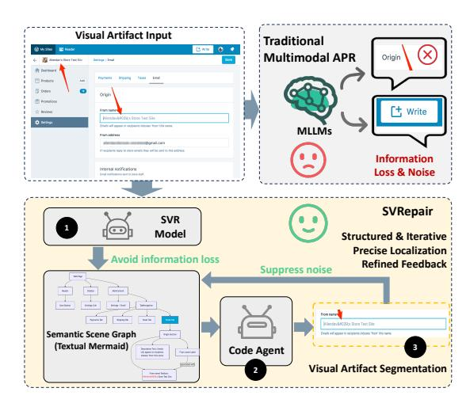
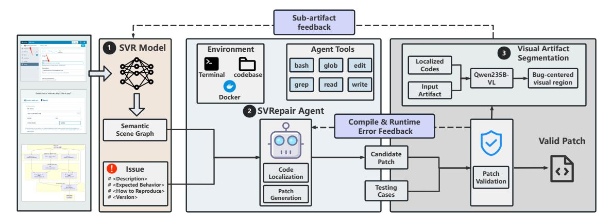
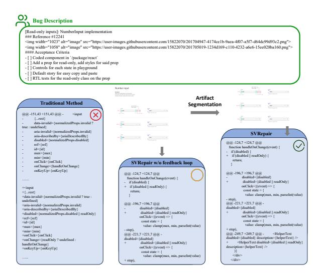

# **SVRepair: Structured Visual Reasoning for Automated Program Repair**

**Xiaoxuan Tang**∗,1 **Jincheng Wang**∗,1 **Liwei Luo**<sup>1</sup> **Jingxuan Xu**<sup>1</sup> **Sheng Zhou**†,2 **Dajun Chen**<sup>1</sup> **Wei Jiang**<sup>1</sup> **Yong Li**†,1

### <sup>1</sup> **Ant Group**

<sup>2</sup>Zhejiang Key Laboratory of Accessible Perception and Intelligent Systems, Zhejiang University

§ <https://github.com/codefuse-ai/CodeFuse-SVR> <http://huggingface.co/codefuse-ai/CodeFuse-SVR-8B>

### **Abstract**

Large language models (LLMs) have recently shown strong potential for Automated Program Repair (APR), yet most existing approaches remain unimodal and fail to leverage the rich diagnostic signals contained in visual artifacts such as screenshots and control-flow graphs. In practice, many bug reports convey critical information visually (e.g., layout breakage or missing widgets), but directly using such dense visual inputs often causes context loss and noise, making it difficult for MLLMs to ground visual observations into precise fault localization and executable patches. To bridge this semantic gap, we propose **SVRepair**, a multimodal APR framework with structured visual representation. SVRepair first fine-tunes a vision-language model, **Structured Visual Representation (SVR)**, to uniformly transform heterogeneous visual artifacts into a *semantic scene graph* that captures GUI elements and their structural relations (e.g., hierarchy), providing normalized, code-relevant context for downstream repair. Building on the graph, SVRepair drives a coding agent to localize faults and synthesize patches, and further introduces an iterative visual-artifact segmentation strategy that progressively narrows the input to bug-centered regions to suppress irrelevant context and reduce hallucinations. Extensive experiments across multiple benchmarks demonstrate state-of-the-art performance: SVRepair achieves **36.47%** accuracy on SWE-Bench M, **38.02%** on MMCode, and **95.12%** on CodeVision, validating the effectiveness of SVRepair for multimodal program repair.

### **1 Introduction**

Automated Program Repair (APR) aims to streamline software maintenance by automatically fixing bugs. By doing so, software developers minimize manual labor and enhance code reliability [Renzullo](#page-11-0) [et al.](#page-11-0) [\(2025\)](#page-11-0); [Huang et al.](#page-10-0) [\(2024\)](#page-10-0).

Recently, large language models, benefiting from strong natural-language reasoning and code understanding capabilities, have become a promising foundation for APR, and LLM-based approaches have shown substantial potential [Yang et al.](#page-12-0) [\(2024\)](#page-12-0); [Ruan et al.](#page-11-1) [\(2024\)](#page-11-1).

These methods typically rely on unimodal inputs—such as textual issue reports and specifications—to localize faults in the target codebase and generate candidate patches.

<sup>∗</sup>Equal Contribution.

<sup>†</sup>Corresponding author.

<sup>{</sup>tangxiaoxuan.txx, xiangjiang.wjc,luoliwei.llw,xujingxuan.xjx,chendajun.cdj,jonny.jw,liyong.liy}@antgroup.com zhousheng\_zju@zju.edu.cn

<span id="page-1-0"></span>

Figure 1: Comparison between traditional Multimodal APR and the proposed SVRepair framework.

However, in modern software development, defects are often identified and reported through *visual artifacts* (e.g., screenshots of erroneous web pages and control-flow graphs), which are not captured by unimodal formulations.

A more fundamental obstacle is that many bug reports convey crucial diagnostic signals visually rather than purely through text (e.g., layout breakage, missing widgets, or incorrect rendering states). While modern multimodal LLMs are increasingly capable of perceiving and describing such visual artifacts, they often struggle to ground these observations into the codebase—i.e., to identify the responsible program locations and synthesize correct, executable edits. This mismatch between visual understanding and code-level repair creates a semantic gap that remains a core hurdle for multimodal APR.

Specifically, we identify two primary challenges that hinder the effectiveness of existing APR tools.

The **first** challenge is *context loss in visual artifacts*. Visual artifacts associated with coding issues often encode fine-grained information about graphical elements and their hierarchical organization. Such context provides strong cues for both fault localization (where the bug manifests) and defect characterization (what kind of bug it is). For instance, the artifact in Figure 1 shows the problematic "FromName" field and its garbling issue. Moreover, the element hierarchy relationship reveals that the field is nested within the "Origin" container, directly linking the component structure to the erroneous source files (e.g., notifications-origin.js). Unfortunately, without extracting these contexts from the visual artifact, it is difficult for APR tools to perform bug localization and patch generation.

The **second** challenge arises in the density of visual information. Specifically, since modern software interfaces are dense (e.g., a single screenshot may contain dozens of nested components and state indicators), the visual artifact records fruitful information, which may contain a large amount of bug-irrelevant information (e.g., the upper-right write button in the example artifact). When the noisy contexts are fed to the LLM, it may hallucinate about the bug location and the patching plan. Therefore, it is necessary to scope the visual contexts, such that the LLM can precisely pinpoint the to-be-patched codes.

To address the above challenges, in this work, we propose SVRepair, a multimodal APR framework with a structured visual representation.

• As shown in Figure 1, to address the challenges of dense and heterogeneous visual information, we first finetune a vision-language model, which we term Structured Visual Representation. SVR's core innovation lies in its ability to uniformly transform diverse visual artifacts into a comprehensive semantic scene graph. This graph textually and structurally details GUI element information and their intricate relationships (e.g., hierarchy), providing a normalized and rich context for subsequent

SVRepair

LLM processing, thereby mitigating hallucination and improving bug localization precision. <sup>2</sup> Taking the graph as inputs, SVRepair drives a coding agent, centered with coding LLMs, to perform bug localization and patch generation.

<sup>3</sup> To mitigate noise from redundant or irrelevant visual context, we further introduce a visualartifact segmentation strategy that leverages the patch generated in the previous round to refine and segment the visual inputs for subsequent iterations. The generated sub-artifact will be narrowed to a smaller bug-centered region, and in the next round, it will be fed to SVR to extract more related bug contexts.

We conduct comprehensive experiments on diverse and widely used benchmarks, achieving stateof-the-art performance across all of them, which validates the effectiveness of our approach. In particular, SVRepair attains an accuracy of 36.47% on SWE-Bench M, 38.02% on MMCode, and 95.12% on CodeVision. Overall, our primary contributions are summarized as follows:

- We introduce SVRepair, the multimodal APR framework with a structured visual representation. The fine-tuned vision-language model maps visual artifacts about coding issues to semantic scene graphs, bridging the gap between visual semantics and source codes.
- To handle complex visual artifacts and redundant visual contexts, we propose a visual segmentation technique to iteratively narrow the artifact into bug-centered regions, facilitating precise context generation and patch generation.
- SVRepair achieves state-of-the-art results across all evaluated benchmarks, reaching 36.47% accuracy on SWE-Bench M, 38.02% on MMCode, and 95.12% on CodeVision, demonstrating its effectiveness for multimodal APR.

# **2 Related Works**

#### **2.1 Multimodal Code Generation**

Multimodal large language models (MLLMs) code generation studies how to synthesize executable code or structured markup from visual inputs, and has advanced notably across several domains. In the web/UI setting, prior work develops image-to-HTML generation datasets and evaluations (e.g., Pix2Code [Beltramelli](#page-10-1) [\(2018\)](#page-10-1), WebSight [Laurençon et al.](#page-10-2) [\(2024\)](#page-10-2), Design2Code [Si et al.\)](#page-11-2) and scales them up with larger webpage-to-code corpora (e.g., Web2Code [Yun et al.](#page-12-1) [\(2024\)](#page-12-1), WebCode2M [Gui et al.](#page-10-3) [\(2025\)](#page-10-3)), while some methods incorporate layout-aware modeling to improve structural correctness. In the chart and scientific-plot domain, benchmarks and datasets [Wu et al.](#page-11-3) [\(2025\)](#page-11-3); [Zhao et al.](#page-12-2) [\(2025\)](#page-12-2) evaluate both understanding and chart-to-code reproduction. Related efforts [Wang et al.](#page-11-4) [\(2025b\)](#page-11-4) extend to diagram-to-LaTex conversion and structured vector graphics generation, covering tasks such as converting scientific figures into LaTex code and producing SVG programs [Yang et al.](#page-12-3) [\(2025b\)](#page-12-3); [Rodriguez et al.](#page-11-5) [\(2025\)](#page-11-5) for icons and illustrations. More general-purpose benchmarks [Li et al.](#page-11-6) [\(2024\)](#page-11-6); [Zhang et al.](#page-12-4) [\(2025\)](#page-12-4) further evaluate multimodal coding with visual inputs in algorithmic problem solving. Despite rapid progress, existing approaches remain largely task- and domain-specific and rely heavily on supervised fine-tuning, which is often insufficient to consistently guarantee both code executability and faithful visual–code alignment.

#### **2.2 LLMs/MLLMs for APR**

Researchers have extensively explored the LLM's potential for APR tasks. Early works try to solve software defects by fine-tuning LLMs [Jiang et al.](#page-10-4) [\(2023\)](#page-10-4); [Xia et al.](#page-12-5) [\(2023\)](#page-12-5); [Wu et al.](#page-12-6) [\(2023\)](#page-12-6) and prompting [Xia & Zhang](#page-12-7) [\(2022\)](#page-12-7); [Fan et al.](#page-10-5) [\(2023\)](#page-10-5); [Zhao et al.](#page-12-8) [\(2024\)](#page-12-8). They usually focus on function-level APR, i.e., analyzing and patching a single function. Recently, researchers have started exploring agent systems to solve complex repo-level issue scenarios [Zhang et al.](#page-12-9) [\(2024\)](#page-12-9); [Yang et al.](#page-12-0) [\(2024\)](#page-12-0); [Xia et al.](#page-12-10) [\(2025\)](#page-12-10); [Ma et al.](#page-11-7) [\(2025\)](#page-11-7); [Antoniades et al.](#page-10-6) [\(2024\)](#page-10-6). For instance, SWE-Agent [Yang et al.](#page-12-0) [\(2024\)](#page-12-0) focuses on SWE-Bench [Jimenez et al.](#page-10-7) [\(2023\)](#page-10-7), and solves SWE problems by designing an Agent

<span id="page-3-0"></span>

Figure 2: Architecture of SVRepair. The overall workflow comprises three core components: (1) the SVR Model, which transforms input images into semantic scene graphs; (2) the SVRepair Agent, responsible for bug-related code localization and patch generation; and (3) the Visual Artifact Segmentation module, which identifies the most relevant bug-related areas. The SVRepair Agent establishes an iterative refinement loop to produce validated patches that pass test case verification.

Computer Interface to interact with the environment. While they achieve promising results, they mainly focus on unimodal APR tasks and cannot process repo issues with visual evidence.

A notable contribution to multimodal APR is the recently proposed GUIRepair Huang et al. (2025). It leverages pre-trained vision-language models (e.g., GPT-4o) to translate visual artifacts into issue reproduction codes. These reproduced scripts are then utilized to localize buggy files and specific lines of code within the target codebase. However, this reproduction process often loses critical context from the original figures, such as bug types and related UI components. Consequently, this insufficient context hinders both precise bug localization and the generation of effective patching plans. Our approach overcomes these challenges by transforming visual artifacts into a structured intermediate representation that encompasses element attributes in the visual artifact and their hierarchical relationships. This structured description not only preserves the complete visual context but also provides explicit logical constraints and interpretability for subsequent patch generation.

#### <span id="page-3-1"></span>3 Method

The architecture of SVRepair is illustrated in Figure 2 and consists of three core modules: (1) the SVR vision language model for visual artifact reasoning, (2) the coding agent for patch generation, and (3) the patch validation module. Specifically, SVR processes visual artifacts, e.g., faulty HTML webpage renderings, and produces a structured intermediate representation in textual format (Section 3.1). The coding agent then ingests this IR along with the target code repository to initiate bug localization and patch generation (Section 3.2). Finally, the candidate patches are validated against a suite of predefined test cases.

When processing complex visual artifacts, the initial IR may contain significant noise and coarse-grained bug information. This lack of precision often leads to overly broad localization results, thereby reducing patching efficiency. To mitigate this, SVRepair utilizes a feedback loop based on validation results (Section 3.3): It segments complex artifacts into several focused sub-artifacts. The most relevant sub-artifact is then fed back into the SVR model for iterative visual reasoning. The resulting refined IR provides the granular detail necessary to significantly enhance the success rate of subsequent patching rounds.

#### <span id="page-4-0"></span>**3.1 Structured Visual Representation Model**

**IR definition.** To bridge the semantic gap between heterogeneous visual artifacts (e.g., HTML web pages, flowcharts, and control flow graphs) and executable code, we propose a unified intermediate representation: Semantic Scene Graph (SSG). This representation serves as a structured guide for SVR training, grounded in the observation that software-centric visual artifacts usually convey information at two distinct levels:

- Visual Element Attributes: The geometric layout, coordinates, and visual appearance of individual components.
- Relational Connectivity: The logical hierarchy and functional relationships between these components.

To formalize these observations, we define a Semantic Scene Graph as a directed cyclic graph G = (V, E). V is the set of nodes representing visual elements, e.g., a button element in the HTML webpage or a basic block in a control flow graph. The set of edges E represents directional relationships, where an edge *e* ∈ E is a tuple:

$$e = (u, v, r)$$
 where  $u, v \in \mathcal{V}, r \in \mathcal{R}$ 

Here, R denotes a finite set of relation types, including control flow, data flow, and compositional hierarchy. By capturing both discrete components and their logical inter-dependencies, the SSG preserves the critical context necessary for comprehensive issue understanding.

To ensure compatibility with downstream coding LLMs, the SSG is serialized into a textual format following Mermaid syntax. Nodes may contain snippets of source code (e.g., HTML tags) or natural language descriptions, while edges utilize Mermaid's directed edge notation to maintain structural integrity.

**Data collection.** To build the training dataset, we mainly focus on two types of visual artifacts: program control flow graphs and HTML webpages. They are common in GitHub issue forums and public multimodal APR benchmarks, e.g., SWE-Bench M [Yang et al.](#page-12-0) [\(2024\)](#page-12-0).

Specifically, we collect the following datasets as training materials.

- *WebSight* [Laurençon et al.](#page-11-8) [\(2024\)](#page-11-8). WebSight is a large-scale dataset comprising 2 million examples of HTML code paired with corresponding high-resolution screenshots (their rendered output). We transform the raw HTML into the SSG by parsing the HTML document object model (DOM) tree. Each HTML element (e.g., <div> and <button>) is transformed into a node, and the DOM hierarchy is used to define composition edges.
- *High-rating GitHub Repositories.* We collect 37 high-rating Github repos (e.g., pandas and numpy) based on their popularity and reported issue count. For these repositories, we first extract complex function definitions with lines of code larger than 20, and construct their control flow graphs by staticfg. Each node in the control flow graph is directly mapped to SSG nodes, and the directional edges in the graph, which signify the execution path, are mapped to SSG edges with the relation type control flow.

**Model Training**. With the collected (issue image, SSG) pairs, we train a model called SVR, aiming to build the bridge between the image and the codes. Specifically, we initiate Fine-Tuning [Ouyang](#page-11-9) [et al.](#page-11-9) [\(2022\)](#page-11-9); [Lv et al.](#page-11-10) [\(2024\)](#page-11-10) for its efficiency and effectiveness. Towards this end, we use a standard autoregressive objective to train the model.

$$L(\theta) := -\mathbb{E}_{(x,y)\sim D} \left[ \sum_{t=1}^{T} \log P(y_t|x,y_{< t};\theta) \right],$$

where *D* is the collected dataset and (*x*, *y*) is the (visual artifact, expected SSG) pair.

#### <span id="page-5-0"></span>**3.2 SVRepair Agent**

Taking the target codebase and the IR as inputs, the SVRepair Agent is responsible for localizing bugs and generating patches. Towards this end, the agent is equipped with the following capabilities.

**Virtual environment setup.** The agent executes within a secure and isolated Docker environment that precisely simulates a real-world development setting. This environment grants the agent access to the full project codebase, a functional terminal for command execution, and the necessary runtime dependencies (e.g., Node.js, Python) required to build and test the patch.

**Tools setup.** To facilitate interaction with the environment, the agent is equipped with a suite of specialized tools.

- *Code navigation tools*: The agent uses grep and glob to perform keyword-based searches across the codebase. It generates search queries based on terms identified in the bug report to narrow down the search space to relevant files.
- *Filesystem tools*: Once candidate files are localized, the agent employs read\_file to inspect the source code, and write\_file or edit\_file to apply candidate patches.
- *Execution tools*: A bash tool allows the agent to run shell commands, such as installing dependencies, compiling code, or executing test suites.

The agent follows a cyclic Localization → Generation → Validation workflow. Specifically, the agent starts by searching the codebase for symbols or error messages mentioned in the IR. It iteratively reads files to understand the control flow and identify the root cause of the failure. After identifying the buggy code fragment, the agent leverages a coding LLM to generate a candidate patch. The prompt provided to the LLM includes the original code context and the issue description, which is shown in Appendix [A.](#page-13-0)

After patch generation, the agent attempts to verify the fix by running existing test suites (e.g., npm test). If the environment lacks specific test dependencies (e.g., a missing yarn command or an ERR\_MODULE\_NOT\_FOUND error), the agent demonstrates resilient validation: It autonomously creates a standalone "manual" test script (test\_fix.js) using write\_file. This script mocks the necessary environment variables and imports to verify the logic of the fix in isolation.

#### <span id="page-5-1"></span>**3.3 Visual Artifact Segmentation**

Once candidate patches are generated, they are validated against a suite of unit test cases. A patch is considered valid only if it passes all tests. Otherwise, the validation agent collects feedback (e.g., compilation error logs) to initiate a new round of patch generation. Notably, we observe that the success rate of patches decreases significantly as the complexity of the input visual artifact—measured by the number of elements—increases.

Investigating the root cause, we find that for complex artifacts, SVR generates textual contexts that are comprehensive yet coarse-grained. Specifically, it records an excessive amount of information regarding bug-irrelevant elements, while the descriptions of bug-relevant elements remain sparse. For example, in Figure [1,](#page-1-0) the SVR-generated context includes details about the "Write" button, whereas the actual buggy element (the "FromName" textbox) is only vaguely described. When these noisy contexts are fed into the SVRepair agent, they hinder precise localization, leading the agent to identify excessively large code regions and produce erroneous patching locations (false positives). Furthermore, because the bug-relevant information is insufficiently detailed, the agent may misinterpret the bug type and generate incorrect patching plans (false negatives).

To mitigate these challenges, we propose a recursive segmentation strategy for the visual artifacts. When a candidate patch fails validation, the system extracts a focused sub-artifact centered on the suspected bug region to serve as refined feedback for the subsequent generation cycle. Specifically, we leverage a pre-trained vision-language model (e.g., Qwen3-VL-235B [Team](#page-11-11) [\(2025\)](#page-11-11)) to perform precise visual grounding. By providing the original visual artifact, the issue description, and the

SVRepair

localized code snippets as context, we prompt the model to predict the specific coordinates of the bug-relevant area (Appendix [B\)](#page-14-0). This region is then cropped into a targeted bounding box, effectively filtering out irrelevant elements and providing the SVRepair agent with a high-fidelity, fine-grained context for the next round of repair. To prevent an infinite feedback loop, we implement a maximum iteration threshold. Given the typical complexity of standard visual artifacts, a threshold of three rounds is generally sufficient to achieve convergence or identify a valid patch.

### **4 Experiments**

In this section, we first introduce the implementation details of SVRepair. Then we evaluate its effectiveness and performance.

### **4.1 Implementation Details**

For SVR, we use Qwen3-VL-8B [Team](#page-11-11) [\(2025\)](#page-11-11) as the base VLM for supervised fine-tuning. Qwen3- VL-8B offers a favorable trade-off between model capability and computational cost, enabling efficient deployment while maintaining competitive performance. The training is performed on 8 NVIDIA H20 96GB GPUs, and the process includes three epochs, which balance the convergence and over-fitting.

The model is trained for 2 epochs to achieve optimal convergence while mitigating the risk of overfitting. The learning rate is set to 1e-5 throughout the training process.

### **4.2 Evaluation Setup**

**Baseline selection.** We compare SVRepair against two baseline categories.

- Multimodal LLMs: Claude [Anthropic.](#page-10-9) [\(2025\)](#page-10-9), Qwen-VL [Bai et al.](#page-10-10) [\(2025\)](#page-10-10); [Team](#page-11-11) [\(2025\)](#page-11-11), and GPT-4o [Hurst et al.](#page-10-11) [\(2024\)](#page-10-11) are selected to establish a foundation for zero-shot cross-modal reasoning.
- Autonomous Systems: We evaluate state-of-the-art agentic and agentless frameworks, including GUIRepair [Huang et al.](#page-10-8) [\(2025\)](#page-10-8), Refact Agent [Refact.ai](#page-11-12) [\(2025\)](#page-11-12), OpenHands [Wang](#page-11-13) [et al.](#page-11-13) [\(2024\)](#page-11-13), and Agentless [Xia et al.](#page-12-11) [\(2024\)](#page-12-11).

**Benchmark selection.** We evaluate the effectiveness of the baseline methods using three diverse benchmarks: SWE-Bench M [Yang et al.](#page-12-12) [\(2025a\)](#page-12-12), MMCode [Li et al.](#page-11-6) [\(2024\)](#page-11-6), and CodeVision [Wang](#page-11-14) [et al.](#page-11-14) [\(2025a\)](#page-11-14). SWE-Bench M consists of 617 task instances across 17 JavaScript repositories, designed to assess the ability of autonomous agents to resolve real-world, user-facing software engineering issues. MMCode provides a large-scale evaluation of algorithmic problem-solving, comprising 3,548 questions and 6,620 images harvested from programming competitions. Similarly, CodeVision is a visual-centric benchmark that requires models to translate complex flowchart logic directly into executable programs. Although MMCode and CodeVision were originally designed for code generation, we treat these tasks as a form of APR within our framework. Specifically, the high-level program requirements are modeled as issue descriptions, tasking the agent with synthesizing a correct implementation that satisfies the provided specifications.

#### **4.3 Effectiveness of Multimodal APR**

Table [1](#page-7-0) and Table [2](#page-7-1) report the results on three benchmarks. Following prior work in code generation and APR [Chen](#page-10-12) [\(2021\)](#page-10-12); [Roziere et al.](#page-11-15) [\(2023\)](#page-11-15), we use Pass@1 (%Resolved) as the metric, which evaluates whether the top-ranked patch successfully fixes the issue. On SWE-Bench M (Table [1\)](#page-7-0), SVRepair achieves the best performance with a Pass@1 of **36.47%**, outperforming all competing methods, including the prior SOTA system GUIRepair (35.98%). Beyond accuracy, SVRepair is more efficient at inference time: it follows a greedy decoding strategy within a lightweight feedback loop, generating

| Method          | Base model        | Resolved |
|-----------------|-------------------|----------|
| RAG             | GPT-4o            | 6.00     |
| SWE-Agent       | GPT-4o            | 11.99    |
| Agentless Lite  | Claude-3.5 Sonnet | 25.34    |
| OpenHands-Versa | Claude-Sonnet 4   | 34.43    |
| GUIRepair       | GPT-o3            | 35.98    |
| SVRepair        | SVR-8B+GPT-o3     | 36.47    |

<span id="page-7-0"></span>Table 1: The Pass@1 rate (%) comparison results on SWE-Bench M.

<span id="page-7-1"></span>Table 2: The Pass@1 rate (%) comparison results on MMCode and CodeVision.

| Method            | MMCode | CodeVision |
|-------------------|--------|------------|
| GPT-4o            | 11.79  | 92.07      |
| Claude 3.5 Sonnet | 27.09  | 82.30      |
| Claude 4.0        | 37.02  | 84.75      |
| Qwen3-VL-235B     | 34.73  | 88.41      |
| SVRepair          | 38.02  | 95.12      |

one patch per iteration and refining the solution based on execution feedback, whereas GUIRepair relies on multi-sampling (temperature = 1) to produce up to 40 patch candidates for selection.

On other multimodal benchmarks (Table [2\)](#page-7-1), SVRepair again attains the top results, achieving **38.02%** on MMCode and **95.12%** on CodeVision, surpassing strong multimodal baselines such as GPT-4o, Claude models, and Qwen3-VL-235B. These consistent gains across datasets demonstrate the effectiveness of SVRepair for multimodal APR, and we further attribute the improvements to SVR's visual understanding and the artifact segmentation strategy (Section [4.4\)](#page-7-2).

#### <span id="page-7-2"></span>**4.4 Ablation Study**

To evaluate the contribution of each component within the SVRepair framework, we conducted a systematic ablation study across the three benchmarks. Our analysis focuses on four incremental configurations. **V1 (Baseline)**: Unimodal prompt engineering using only the coding LLM with textual issue descriptions. **V2 (+Vision)**: Adds visual artifact descriptions in natural language. **V3 (+SVR)**: Incorporates our SVR model to transform visual artifacts into semantic scene graphs. **V4 (+Sub-artifact feedback)**: The final SVRepair, including the iterative sub-artifact feedback strategy.

The results of the ablation study, summarized in Table [3,](#page-8-0) reveal several key insights into the effectiveness of SVRepair in automated program repair.

**Impact of visual information**. Comparing V1 and V2 reveals a nuanced relationship between vision information and multimodal APR tasks. For CodeVision, the inclusion of visual artifacts provides a massive performance boost, increasing the Pass@1 rate from 60.36% to 89.02%. This confirms that visual context is indispensable for multimodal APR tasks.

**The superiority of SVR.** The transition from V2 to V3 highlights the critical role of our proposed intermediate visual representation. By converting heterogeneous visual artifacts into a semantic scene graph, SVRepair bridges the semantic gap between pixels and code. This refinement led to an increasing performance, particularly on MMCode, where the Pass@1 rate jumped from 16.33% to 38.02%. These results demonstrate that SVR effectively provides the downstream coding LLM with the normalized, code-relevant context necessary for precise bug localization and patch generation.

To further evaluate SVR, we assess its performance on Mermaid diagram parsing. We measure (1) Rendering Accuracy to verify syntactic validity and (2) SSIM to evaluate structural fidelity by

<span id="page-8-0"></span>

| ID  | Ablation Design |              | Pass@1 Rate (%)       |             |        |            |
|-----|-----------------|--------------|-----------------------|-------------|--------|------------|
|     | Vision          | SVR (IR)     | Sub-artifact Feedback | SWE-Bench M | MMCode | CodeVision |
| (1) | -               | _            | _                     | 32.88       | 15.34  | 51.83      |
| (2) | $\checkmark$    | _            | _                     | 33.08       | 16.33  | 85.36      |
| (3) | $\checkmark$    | $\checkmark$ | _                     | 35.01       | 38.02  | 95.12      |
| (4) | <b>√</b>        | ✓            | <b>√</b>              | 36.47       | _      | _          |

Table 3: Ablation study result of SVRepair

<span id="page-8-1"></span>Table 4: Mermaid Diagram Parsing Results of Different Models.

| Model         | Rendering Acc (%) | SSIM   |
|---------------|-------------------|--------|
| Qwen3-VL-235B | 94.97             | 0.7006 |
| Qwen3-VL-8B   | 81.14             | 0.6868 |
| SVR-8B        | 94.29             | 0.7892 |

comparing rendered predictions against ground-truth diagrams. To evaluate SVR, we constructed a benchmark of 1,300 code-control flow graph pairs from high-starred GitHub repositories (Section 3). SVR generates semantic scene graphs from these images, which are then rendered into Mermaid figures.

As shown in Table 4, SVR achieves a 94.29% Rendering Accuracy, comparable to the much larger Qwen3-VL-235B (94.97%) and significantly higher than Qwen3-VL-8B. Notably, SVR reaches the highest SSIM (0.7892). While large-scale models maintain syntax, their lower SSIM indicates difficulty preserving spatial relationships. SVR's superior SSIM confirms its effectiveness in capturing fine-grained structural data for high-fidelity reconstruction.

Effectiveness of sub-artifact feedback. The final addition of the sub-artifact feedback strategy (V4) further optimized the results. By iteratively narrowing the visual focus to bug-centered regions, SVRepair successfully filters out the noise (i.e., bug-irrelevant visual information) inherent in dense graphical interfaces. This refinement primarily benefited the complex real-world issues in SWE-Bench M, pushing the performance to SOTA 36.47%. In contrast, the results for MMCode and CodeVision remained identical to V3. This lack of boost is attributable to the fundamental nature of these benchmarks. Specifically, both MMCode and CodeVision were originally designed for code generation. In our study, we adapted these tasks by transforming generation requirements into issue descriptions. They are inherently designed with signal rather than noise. Every pixel and element in these images serves as a direct requirement for the target code. As a result, it is infeasible to apply a sub-artifact feedback strategy for these tasks, which may cause useful information loss.

Note that for the remaining two benchmarks, the feedback strategy is not supposed to be introduced. Specifically, since MMCode and CodeVision are not repository-based code and the provided images are manually generated based on relevant information, they do not contain noise similar to that present in the SWE-Bench-M dataset images. Therefore, we do not employ the Feedback operation on MMCode and CodeVision.

#### 4.5 Case Study

To further clarify the contribution of SVRepair, Figure 3 presents a representative case study that illustrates the comparative effectiveness of our approach against traditional baseline methods. The example involves a NumberInput component bug report requesting the implementation of read-only functionality with specific acceptance criteria. This case demonstrates three fundamental advantages of our methodology: structural artifact understanding, test-driven iterative refinement, and artifact feedback-based noise reduction. The traditional approach, shown on the left, employs

<span id="page-9-0"></span>

Figure 3: The case study comparing a traditional method with SVRepair.

manually-defined test workflows to guide the repair process. However, this method exhibits significant limitations in both localization precision and coverage comprehensiveness. As illustrated, traditional method attempts to modify numerous component properties simultaneously, including 'data-invalid', 'aria-invalid', 'aria-describedby', 'disabled', 'ref', 'id', 'max', 'min', and various event handlers. This scattershot approach stems from two core deficiencies: first, manually-crafted test paths cannot anticipate all boundary conditions and edge cases inherent in complex GUI interactions; second, without precise bug localization mechanisms, the system resorts to broad modifications across potentially relevant code regions. This repair ultimately fails, likely due to either missing the actual bug location or introducing unintended side effects through modifications to unrelated code sections.

In contrast, our proposed SVRepair methodology fundamentally transforms this process through a structural understanding of GUI artifacts. As shown in the middle section of the figure, we first perform artifact segmentation on the interface screenshots, decomposing them into semantically meaningful components. This structural decomposition enables our system to establish explicit mappings between UI elements and their corresponding code-level abstractions, providing the coding agent with precise contextual information that significantly reduces ambiguity.

### **5 Conclusion**

This paper presents SVRepair, a multimodal automated program repair framework that bridges the gap between visual diagnostics and source code. By leveraging our Structured Visual Representation (SVR), we transform heterogeneous visual artifacts—such as screenshots and control-flow graphs—into normalized Semantic Scene Graphs (SSGs). This structured approach, coupled with an iterative segmentation strategy to filter visual noise, significantly enhances fault localization and reduces model hallucinations. Evaluation results demonstrate that SVRepair achieves state-of-the-art performance, outperforming both unimodal agents and general-purpose multimodal LLMs. These results confirm that structured visual representation is essential for the next generation of APR tools. As software development becomes increasingly UI-driven, SVRepair offers a scalable foundation for integrating cross-modal insights into the automated maintenance lifecycle.

# **6 Limitation**

While SVRepair achieves state-of-the-art results, its scope is currently centered on HTML renderings and control-flow graphs. Although the Mermaid-based Semantic Scene Graph (SSG) is inherently extensible to other artifacts like sequence diagrams, these require further domain-specific fine-tuning. Additionally, the iterative segmentation strategy introduces computational overhead; however, this is manageable via configurable iteration thresholds (e.g., *k* = 2). Finally, like most APR frameworks, SVRepair's reliance on Docker-based reproduction can be hindered by OS-specific dependencies. We mitigate this through autonomous "manual" test scripting to mock external environments, though achieving perfect parity for all "in-the-wild" issues remains an open challenge for future research.

# **References**

<span id="page-10-9"></span>Anthropic. Claudeai, 2025. URL <https://claude.ai/>.

- <span id="page-10-6"></span>Antonis Antoniades, Albert Örwall, Kexun Zhang, Yuxi Xie, Anirudh Goyal, and William Wang. Swe-search: Enhancing software agents with monte carlo tree search and iterative refinement. *arXiv preprint arXiv:2410.20285*, 2024.
- <span id="page-10-10"></span>Shuai Bai, Keqin Chen, Xuejing Liu, Jialin Wang, Wenbin Ge, Sibo Song, Kai Dang, Peng Wang, Shijie Wang, Jun Tang, et al. Qwen2. 5-vl technical report. *arXiv preprint arXiv:2502.13923*, 2025.
- <span id="page-10-1"></span>Tony Beltramelli. pix2code: Generating code from a graphical user interface screenshot. In *Proceedings of the ACM SIGCHI symposium on engineering interactive computing systems*, pp. 1–6, 2018.
- <span id="page-10-12"></span>Mark Chen. Evaluating large language models trained on code. *arXiv preprint arXiv:2107.03374*, 2021.
- <span id="page-10-5"></span>Zhiyu Fan, Xiang Gao, Martin Mirchev, Abhik Roychoudhury, and Shin Hwei Tan. Automated repair of programs from large language models. In *2023 IEEE/ACM 45th International Conference on Software Engineering (ICSE)*, pp. 1469–1481. IEEE, 2023.
- <span id="page-10-3"></span>Yi Gui, Zhen Li, Yao Wan, Yemin Shi, Hongyu Zhang, Bohua Chen, Yi Su, Dongping Chen, Siyuan Wu, Xing Zhou, et al. Webcode2m: A real-world dataset for code generation from webpage designs. In *Proceedings of the ACM on Web Conference 2025*, pp. 1834–1845, 2025.
- <span id="page-10-0"></span>Kai Huang, Zhengzi Xu, Su Yang, Hongyu Sun, Xuejun Li, Zheng Yan, and Yuqing Zhang. Evolving paradigms in automated program repair: Taxonomy, challenges, and opportunities. *ACM Computing Surveys*, 57(2):1–43, 2024.
- <span id="page-10-8"></span>Kai Huang, Jian Zhang, Xiaofei Xie, and Chunyang Chen. Seeing is fixing: Cross-modal reasoning with multimodal llms for visual software issue fixing. *arXiv preprint arXiv:2506.16136*, 2025.
- <span id="page-10-11"></span>Aaron Hurst, Adam Lerer, Adam P Goucher, Adam Perelman, Aditya Ramesh, Aidan Clark, AJ Ostrow, Akila Welihinda, Alan Hayes, Alec Radford, et al. Gpt-4o system card. *arXiv preprint arXiv:2410.21276*, 2024.
- <span id="page-10-4"></span>Nan Jiang, Kevin Liu, Thibaud Lutellier, and Lin Tan. Impact of code language models on automated program repair. In *2023 IEEE/ACM 45th International Conference on Software Engineering (ICSE)*, pp. 1430–1442. IEEE, 2023.
- <span id="page-10-7"></span>Carlos E Jimenez, John Yang, Alexander Wettig, Shunyu Yao, Kexin Pei, Ofir Press, and Karthik Narasimhan. Swe-bench: Can language models resolve real-world github issues? *arXiv preprint arXiv:2310.06770*, 2023.
- <span id="page-10-2"></span>Hugo Laurençon, Léo Tronchon, and Victor Sanh. Unlocking the conversion of web screenshots into html code with the websight dataset. *arXiv preprint arXiv:2403.09029*, 2024.

- <span id="page-11-8"></span>Hugo Laurençon, Léo Tronchon, and Victor Sanh. Unlocking the conversion of web screenshots into html code with the websight dataset, 2024.
- <span id="page-11-6"></span>Kaixin Li, Yuchen Tian, Qisheng Hu, Ziyang Luo, Zhiyong Huang, and Jing Ma. Mmcode: Benchmarking multimodal large language models for code generation with visually rich programming problems. *arXiv preprint arXiv:2404.09486*, 2024.
- <span id="page-11-10"></span>Kai Lv, Yuqing Yang, Tengxiao Liu, Qipeng Guo, and Xipeng Qiu. Full parameter fine-tuning for large language models with limited resources. In *Proceedings of the 62nd Annual Meeting of the Association for Computational Linguistics (Volume 1: Long Papers)*, pp. 8187–8198, 2024.
- <span id="page-11-7"></span>Yingwei Ma, Qingping Yang, Rongyu Cao, Binhua Li, Fei Huang, and Yongbin Li. Alibaba lingmaagent: Improving automated issue resolution via comprehensive repository exploration. In *Proceedings of the 33rd ACM International Conference on the Foundations of Software Engineering*, pp. 238–249, 2025.
- <span id="page-11-9"></span>Long Ouyang, Jeffrey Wu, Xu Jiang, Diogo Almeida, Carroll Wainwright, Pamela Mishkin, Chong Zhang, Sandhini Agarwal, Katarina Slama, Alex Ray, et al. Training language models to follow instructions with human feedback. *Advances in neural information processing systems*, 35:27730– 27744, 2022.
- <span id="page-11-12"></span>Refact.ai. Refact - open sourced ai software development agent, 2025. URL [https://github.com/s](https://github.com/smallcloudai/refact) [mallcloudai/refact](https://github.com/smallcloudai/refact).
- <span id="page-11-0"></span>Joseph Renzullo, Pemma Reiter, Westley Weimer, and Stephanie Forrest. Automated program repair: Emerging trends pose and expose problems for benchmarks. *ACM Computing Surveys*, 57(8):1–18, 2025.
- <span id="page-11-5"></span>Juan A Rodriguez, Abhay Puri, Shubham Agarwal, Issam H Laradji, Pau Rodriguez, Sai Rajeswar, David Vazquez, Christopher Pal, and Marco Pedersoli. Starvector: Generating scalable vector graphics code from images and text. In *Proceedings of the Computer Vision and Pattern Recognition Conference*, pp. 16175–16186, 2025.
- <span id="page-11-15"></span>Baptiste Roziere, Jonas Gehring, Fabian Gloeckle, Sten Sootla, Itai Gat, Xiaoqing Ellen Tan, Yossi Adi, Jingyu Liu, Romain Sauvestre, Tal Remez, et al. Code llama: Open foundation models for code. *arXiv preprint arXiv:2308.12950*, 2023.
- <span id="page-11-1"></span>Haifeng Ruan, Yuntong Zhang, and Abhik Roychoudhury. Specrover: Code intent extraction via llms. *arXiv preprint arXiv:2408.02232*, 2024.
- <span id="page-11-2"></span>Chenglei Si, Yanzhe Zhang, Zhengyuan Yang, Ruibo Liu, and Diyi Yang. Design2code: How far are we from automating front-end engineering?, 2024. *URL https://arxiv. org/abs/2403*, 3163.
- <span id="page-11-11"></span>Qwen Team. Qwen3 technical report, 2025. URL <https://arxiv.org/abs/2505.09388>.
- <span id="page-11-14"></span>Hanbin Wang, Xiaoxuan Zhou, Zhipeng Xu, Keyuan Cheng, Yuxin Zuo, Kai Tian, Jingwei Song, Junting Lu, Wenhui Hu, and Xueyang Liu. Code-vision: Evaluating multimodal llms logic understanding and code generation capabilities. *arXiv preprint arXiv:2502.11829*, 2025a.
- <span id="page-11-4"></span>Ke Wang, Junting Pan, Linda Wei, Aojun Zhou, Weikang Shi, Zimu Lu, Han Xiao, Yunqiao Yang, Houxing Ren, Mingjie Zhan, et al. Mathcoder-vl: Bridging vision and code for enhanced multimodal mathematical reasoning. *arXiv preprint arXiv:2505.10557*, 2025b.
- <span id="page-11-13"></span>Xingyao Wang, Boxuan Li, Yufan Song, Frank F Xu, Xiangru Tang, Mingchen Zhuge, Jiayi Pan, Yueqi Song, Bowen Li, Jaskirat Singh, et al. Openhands: An open platform for ai software developers as generalist agents. *arXiv preprint arXiv:2407.16741*, 2024.
- <span id="page-11-3"></span>Chengyue Wu, Zhixuan Liang, Yixiao Ge, Qiushan Guo, Zeyu Lu, Jiahao Wang, Ying Shan, and Ping Luo. Plot2code: A comprehensive benchmark for evaluating multi-modal large language models in code generation from scientific plots. In *Findings of the Association for Computational Linguistics: NAACL 2025*, pp. 3006–3028, 2025.

- <span id="page-12-6"></span>Yi Wu, Nan Jiang, Hung Viet Pham, Thibaud Lutellier, Jordan Davis, Lin Tan, Petr Babkin, and Sameena Shah. How effective are neural networks for fixing security vulnerabilities. In *Proceedings of the 32nd ACM SIGSOFT International Symposium on Software Testing and Analysis*, pp. 1282–1294, 2023.
- <span id="page-12-7"></span>Chunqiu Steven Xia and Lingming Zhang. Less training, more repairing please: revisiting automated program repair via zero-shot learning. In *Proceedings of the 30th ACM Joint European Software Engineering Conference and Symposium on the Foundations of Software Engineering*, pp. 959–971, 2022.
- <span id="page-12-5"></span>Chunqiu Steven Xia, Yuxiang Wei, and Lingming Zhang. Automated program repair in the era of large pre-trained language models. In *2023 IEEE/ACM 45th International Conference on Software Engineering (ICSE)*, pp. 1482–1494. IEEE, 2023.
- <span id="page-12-11"></span>Chunqiu Steven Xia, Yinlin Deng, Soren Dunn, and Lingming Zhang. Agentless: Demystifying llm-based software engineering agents. *arXiv preprint arXiv:2407.01489*, 2024.
- <span id="page-12-10"></span>Chunqiu Steven Xia, Yinlin Deng, Soren Dunn, and Lingming Zhang. Demystifying llm-based software engineering agents. *Proceedings of the ACM on Software Engineering*, 2(FSE):801–824, 2025.
- <span id="page-12-0"></span>John Yang, Carlos E Jimenez, Alexander Wettig, Kilian Lieret, Shunyu Yao, Karthik Narasimhan, and Ofir Press. Swe-agent: Agent-computer interfaces enable automated software engineering. *Advances in Neural Information Processing Systems*, 37:50528–50652, 2024.
- <span id="page-12-12"></span>John Yang, Carlos E. Jimenez, Alex L. Zhang, Kilian Lieret, Joyce Yang, Xindi Wu, Ori Press, Niklas Muennighoff, Gabriel Synnaeve, Karthik R. Narasimhan, Diyi Yang, Sida I. Wang, and Ofir Press. SWE-bench multimodal: Do ai systems generalize to visual software domains? In *The Thirteenth International Conference on Learning Representations*, 2025a. URL [https://openreview.net/forum](https://openreview.net/forum?id=riTiq3i21b) [?id=riTiq3i21b](https://openreview.net/forum?id=riTiq3i21b).
- <span id="page-12-3"></span>Yiying Yang, Wei Cheng, Sijin Chen, Xianfang Zeng, Fukun Yin, Jiaxu Zhang, Liao Wang, Gang Yu, Xingjun Ma, and Yu-Gang Jiang. Omnisvg: A unified scalable vector graphics generation model. In *The Thirty-ninth Annual Conference on Neural Information Processing Systems*, 2025b.
- <span id="page-12-1"></span>Sukmin Yun, Rusiru Thushara, Mohammad Bhat, Yongxin Wang, Mingkai Deng, Jinhong Wang, Tianhua Tao, Junbo Li, Haonan Li, Preslav Nakov, et al. Web2code: A large-scale webpage-to-code dataset and evaluation framework for multimodal llms. *Advances in neural information processing systems*, 37:112134–112157, 2024.
- <span id="page-12-4"></span>Linhao Zhang, Daoguang Zan, Quanshun Yang, Zhirong Huang, Dong Chen, Bo Shen, Tianyu Liu, Yongshun Gong, Huang Pengjie, Xudong Lu, et al. Codev: issue resolving with visual data. In *Findings of the Association for Computational Linguistics: ACL 2025*, pp. 7350–7361, 2025.
- <span id="page-12-9"></span>Yuntong Zhang, Haifeng Ruan, Zhiyu Fan, and Abhik Roychoudhury. Autocoderover: Autonomous program improvement. In *Proceedings of the 33rd ACM SIGSOFT International Symposium on Software Testing and Analysis*, pp. 1592–1604, 2024.
- <span id="page-12-8"></span>Jiuang Zhao, Donghao Yang, Li Zhang, Xiaoli Lian, Zitian Yang, and Fang Liu. Enhancing automated program repair with solution design. In *Proceedings of the 39th IEEE/ACM International Conference on Automated Software Engineering*, pp. 1706–1718, 2024.
- <span id="page-12-2"></span>Xuanle Zhao, Xianzhen Luo, Qi Shi, Chi Chen, Shuo Wang, Zhiyuan Liu, and Maosong Sun. Chartcoder: Advancing multimodal large language model for chart-to-code generation. *arXiv preprint arXiv:2501.06598*, 2025.

# <span id="page-13-0"></span>**A Coding Agent Prompt**

#### **System Prompt**

Bug Report is provided with Bug Scenario Images Description. Please analyze the bug scenario images to infer possible bug root cause. The image description has the following formats:

- 1. HTML format: If the Bug Scenario Images is a screenshot of a frontend webpage error
- 2. UML code/Mermaid: If the Bug Scenario Images is a flowchart/sequence diagram, etc.
- 3. Natural language: If the Bug Scenario Images is a natural image

Please first localize the bug based on the issue statement, and then generate \*SEARCH/REPLACE\* edits (i.e., patches) to fix the issue.

#### INPUT:

\* Bug Report

'''

Report shows "Emulated Moto G4" when testing on a mobile device ### FAQ

- [X] Yes, my issue is not about [variability](https://github.com/GoogleChrome/lighthouse/blob/ main/docs/variability.md) or [throttling](https://github.com/GoogleChrome/lighthouse/blob/ main/docs/throttling.md).
- [X] Yes, my issue is not about a specific accessibility audit (file with [axecore](https://github.com/dequelabs/axe-core) instead).

### URL

Can not share

### What happened?

I followed the section on [Testing on a mobile device]

(https://github.com/GoogleChrome/lighthouse/blob/main

/docs/readme.md#testing-on-a-mobile-device) to run Lighthouse on a URL on a Moto Power G.

The exact command I ran was

'''

lighthouse

- –port=9222
- –screenEmulation.disabled
- –throttling-method=devtools
- –throttling.cpuSlowdownMultiplier=1
- –no-emulatedUserAgent
- –view
- –print-config

SOME\_URL

'''

I see Lighthouse load the page in Chrome on the phone. However, in the report it says "Emulated Moto G4 with Lighthouse 9.6.8":


### What did you expect?

The LH page would say "Testing on a real device with Lighthouse 9.6.8", or even "Testing on physical Moto Power G device with Lighthouse 9.6.8"

### What have you tried?


```
_No response_
### How were you running Lighthouse?
CLI
### Lighthouse Version
9.6.8
### Chrome Version
107
### Node Version
16.13.2
### OS
Mac OS
### Relevant log output
_No response_
'''
* Bug Scenario Images
'''
['<Image Type>
Screenshot or document
</Iamge Type>
<Image Content>
Captured at Nov 23, 2022, 1:43 PM EST
Initial page load
Emulated Moto G4 with Lighthouse 9.6.8
Slow 4G throttling
Single page load
Using Chromium 107.0.0.0 with cli
Generated by Lighthouse 9.6.8 | File an issue
</Image Content>']
'''
YOU MUST Conduct a careful analysis to ensure your patch is both executable and effectively resolves the
stated problem!
```

# <span id="page-14-0"></span>**B Artifact Segmentation propmt**

#### **System Prompt**

You are a master at analyzing images and code.

# Task I will provide you with a bug report, an image related to the bug (image resolution=resolution), and possibly the code snippet(s) that correspond to the bug. Your job is to analyze both the bug description and the code snippet(s), locate the region in the image that is most relevant to this bug, and return its bounding-box coordinates.

SVRepair

```
# Input
* Bug Report
'''
{{problem_statement}}
'''
* Code snippets
'''
{{code_snips}}
'''
# Output format
<reason>
Please describe your reasoning process.
</reason>
<result>Return the coordinates of the relevant region in the form [x, y, w, h], where x and y are the
coordinates of the top-left corner of the bounding box, and w and h are its width and height.</result>
```