# Benchmark 样本 URL、图片、语言与 Gold 分布分析

本文档由 `notes/main/tupian/benchmark_sample_distribution.py` 自动生成。统计目标是把 benchmark 样本本身讲清楚：每个集合里有多少图片、多少外部 URL、主要语言是什么、gold patch 通常改几个文件，以及这些真实修改能映射到多少 module/function。

先把几个容易误解的口径说清楚：

- **P90**：第 90 百分位数。把所有样本按某个数值从小到大排序，90% 的样本不超过这个值。例如 `Gold文件 P90=8`，意思是约 90% 样本真实修改文件数不超过 8 个。
- **网页 URL**：优先统计样本结构化字段里的 `web_urls`、`website_links`、`website links`、`urls`，这些通常是 issue 里额外引用的网页、playground、commit、文档链接等；只有结构化字段为空时，才从问题文本中兜底抽取 `http(s)` 链接。图片链接单独算入图片数，不重复算作网页 URL。
- **主修改文件类型/语言**：这里不是 GitHub 仓库语言，而是 gold patch 实际改到的文件扩展名推断出的主文件类型。比如 `Markdown`、`MDX`、`JSON`、`SCSS` 表示真实补丁改到了 `.md`、`.mdx`、`.json`、`.scss` 文件，这在前端仓库、文档、配置或快照修改里是正常现象。
- **模态组合**：`图片+网页URL` 表示同一个样本同时有图片证据和非图片网页 URL；`仅图片` 表示有图片但没有结构化网页 URL；`仅网页URL` 表示没有图片但有网页 URL；`纯文本` 表示两者都没有。
- **Gold Module / Gold Function**：与三层评估口径一致，是把 gold patch 的真实修改行映射到 `repo_structures` 抽取出的代码实体后得到的数量。它不是从文件数直接推出来的；如果 patch 改的是 import、配置、顶层常量、JSON、快照或结构抽取不到的区域，那么 module/function 数可能为 0。

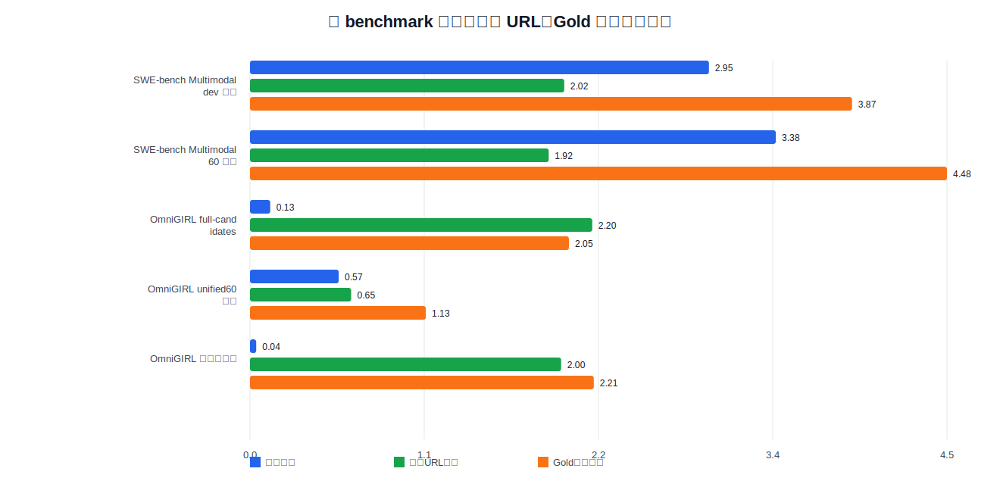

## 1. 总览表

为了避免横向表太宽，下面把每个统计量拆成一行。`均值/中位数/P90/最大值` 分别回答“平均水平、典型样本、偏难样本、极端长尾样本”。

| 数据集 | 样本数 |
|---|---|
| SWE-bench Multimodal dev 全量 | 102 |
| SWE-bench Multimodal 60 子集 | 60 |
| OmniGIRL full-candidates | 631 |
| OmniGIRL unified60 子集 | 60 |
| OmniGIRL 原始源数据 | 959 |

### 1.1 模态证据分布概览

| 数据集 | 指标 | 均值 | 中位数 | P90 | 最大值 |
|---|---|---|---|---|---|
| SWE-bench Multimodal dev 全量 | 图片数 | 2.95 | 1.0 | 4.0 | 73 |
| SWE-bench Multimodal dev 全量 | 网页URL数 | 2.02 | 1.0 | 4.0 | 18 |
| SWE-bench Multimodal 60 子集 | 图片数 | 3.38 | 1.0 | 4.1 | 73 |
| SWE-bench Multimodal 60 子集 | 网页URL数 | 1.92 | 1.0 | 4.0 | 18 |
| OmniGIRL full-candidates | 图片数 | 0.13 | 0 | 0.0 | 6 |
| OmniGIRL full-candidates | 网页URL数 | 2.2 | 2 | 4.0 | 21 |
| OmniGIRL unified60 子集 | 图片数 | 0.57 | 0.0 | 2.0 | 4 |
| OmniGIRL unified60 子集 | 网页URL数 | 0.65 | 1.0 | 1.0 | 3 |
| OmniGIRL 原始源数据 | 图片数 | 0.04 | 0 | 0.0 | 4 |
| OmniGIRL 原始源数据 | 网页URL数 | 2.0 | 1 | 5.0 | 27 |

### 1.2 Gold patch 难度分布概览

| 数据集 | 指标 | 均值 | 中位数 | P90 | 最大值 |
|---|---|---|---|---|---|
| SWE-bench Multimodal dev 全量 | Gold文件数 | 3.87 | 2.0 | 7.9 | 36 |
| SWE-bench Multimodal dev 全量 | Hunk数 | 9.35 | 4.5 | 21.7 | 128 |
| SWE-bench Multimodal dev 全量 | Gold Module数 | 2.67 | 2.0 | 4.0 | 43 |
| SWE-bench Multimodal dev 全量 | Gold Function数 | 5.46 | 3.0 | 8.9 | 121 |
| SWE-bench Multimodal 60 子集 | Gold文件数 | 4.48 | 2.0 | 8.2 | 36 |
| SWE-bench Multimodal 60 子集 | Hunk数 | 11.15 | 5.0 | 22.0 | 128 |
| SWE-bench Multimodal 60 子集 | Gold Module数 | 3.28 | 1.0 | 6.0 | 43 |
| SWE-bench Multimodal 60 子集 | Gold Function数 | 7.13 | 3.0 | 12.1 | 121 |
| OmniGIRL full-candidates | Gold文件数 | 2.05 | 1 | 4.0 | 27 |
| OmniGIRL full-candidates | Hunk数 | 4.82 | 2 | 11.0 | 54 |
| OmniGIRL full-candidates | Gold Module数 | 1.91 | 1 | 4.0 | 23 |
| OmniGIRL full-candidates | Gold Function数 | 3.96 | 1 | 9.0 | 100 |
| OmniGIRL unified60 子集 | Gold文件数 | 1.13 | 1.0 | 1.1 | 3 |
| OmniGIRL unified60 子集 | Hunk数 | 1.58 | 1.0 | 2.1 | 8 |
| OmniGIRL unified60 子集 | Gold Module数 | 1.0 | 1.0 | 2.0 | 10 |
| OmniGIRL unified60 子集 | Gold Function数 | 1.12 | 1.0 | 2.0 | 9 |
| OmniGIRL 原始源数据 | Gold文件数 | 2.21 | 1 | 4.0 | 131 |
| OmniGIRL 原始源数据 | Hunk数 | 5.02 | 2 | 11.0 | 136 |
| OmniGIRL 原始源数据 | Gold Module数 | 0 | 0 | 0 | 0 |
| OmniGIRL 原始源数据 | Gold Function数 | 0 | 0 | 0 | 0 |

从总览看，SWE-bench Multimodal 更偏多图、多 URL、多文件、多 hunk；OmniGIRL unified60 最像小补丁集合，几乎都是单文件小改动。OmniGIRL full-candidates 的样本数更大，整体仍偏少文件，但 function 数存在明显长尾。

### 1.3 口径校验：为什么会有“仅图片”和 Markdown/MDX

这份报告的模态组合不是互斥地看 benchmark 名字，而是逐条样本检查证据字段：

- 如果样本有 `image_urls`，但没有非图片网页 URL，就归为 `仅图片`。
- 如果样本没有图片，但有 `web_urls` 或 `website links`，就归为 `仅网页URL`。
- 如果两类都有，才归为 `图片+网页URL`。

因此，`图片+网页URL` 和 `仅图片` 同时存在是正常现象，表示不同样本携带的证据类型不同，不是统计相加错误。

以 OmniGIRL full-candidates 为例，修正后的模态组合是：

| 模态 | 样本数 |
|---|---|
| 仅网页URL | 583 |
| 图片+网页URL | 40 |
| 仅图片 | 8 |

其中 `仅图片` 的样本示例：

| 样本 | 仓库 | 图片数 | 网页URL数 | Gold文件数 | 主修改文件类型/语言 |
|---|---|---|---|---|---|
| assertj__assertj-1332 | assertj/assertj | 1 | 0 | 1 | Java |
| iamkun__dayjs-1101 | iamkun/dayjs | 1 | 0 | 2 | JavaScript |
| iamkun__dayjs-1131 | iamkun/dayjs | 1 | 0 | 14 | JavaScript |
| iamkun__dayjs-2532 | iamkun/dayjs | 3 | 0 | 1 | JavaScript |
| netty__netty-13114 | netty/netty | 2 | 0 | 1 | Java |
| tqdm__tqdm-1041 | tqdm/tqdm | 1 | 0 | 3 | Python |
| tqdm__tqdm-535 | tqdm/tqdm | 2 | 0 | 3 | Python |
| tqdm__tqdm-537 | tqdm/tqdm | 2 | 0 | 3 | Python |

`Markdown`、`MDX`、`JSON`、`SCSS` 这些语言/文件类型也不是仓库名，而是 gold patch 实际改到的文件类型。例如前端仓库经常会改 `.mdx` 文档、`.json` 配置、`.scss` 样式或 `.md` 说明文件；这些样本在 file-level 仍然是正常代码仓库样本，只是这次真实补丁的主要修改目标不是 `.js/.py/.java` 文件。

## 2. 各数据集详细分布

### 2.1 SWE-bench Multimodal dev 全量

当前本地准备好的 SWE-bench Multimodal dev 全量口径，样本数通常为 102。

- 样本文件：`LocAgent/newtest/swebench_multimodal-full-dev/data/samples.jsonl`
- 结构文件：`LocAgent/newtest/swebench_multimodal-full-dev/repo_structures`
- module/function 可统计样本数：102 / 102

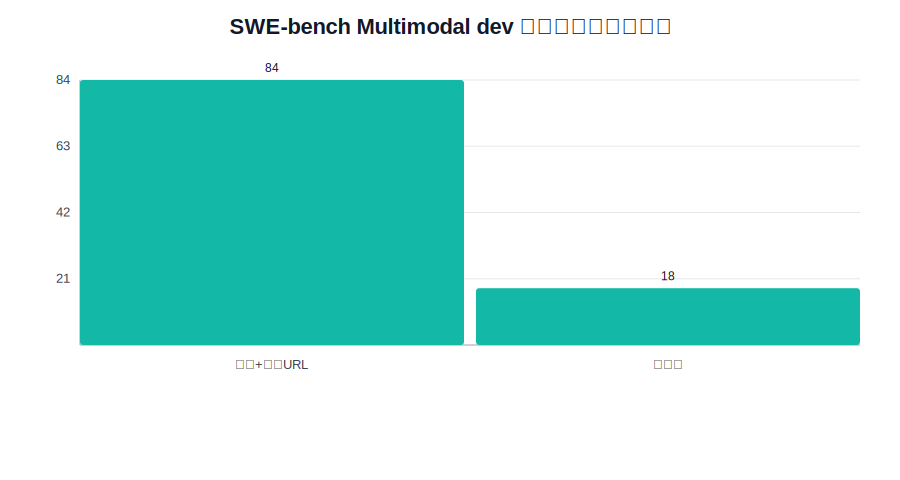

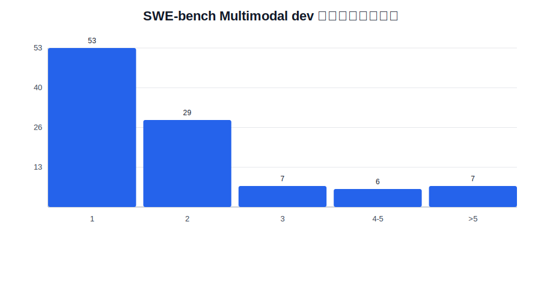
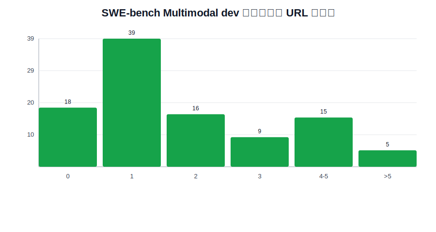
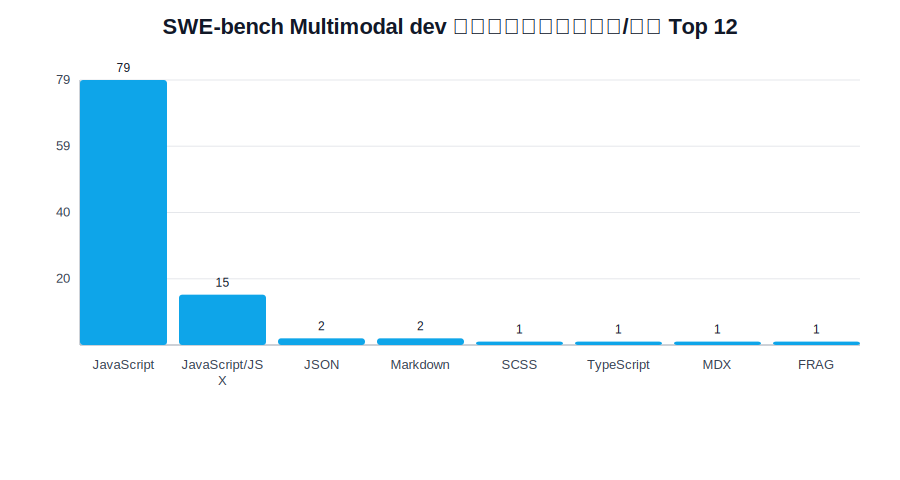
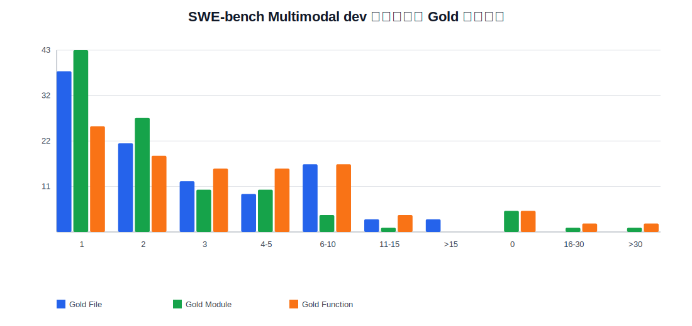

关键分布表：

| 分布项 | 桶 | 样本数 |
|---|---|---|
| 图片数 | 1 | 53 |
| 图片数 | 2 | 29 |
| 图片数 | 3 | 7 |
| 图片数 | 4-5 | 6 |
| 图片数 | >5 | 7 |
| 网页URL数 | 0 | 18 |
| 网页URL数 | 1 | 39 |
| 网页URL数 | 2 | 16 |
| 网页URL数 | 3 | 9 |
| 网页URL数 | 4-5 | 15 |
| 网页URL数 | >5 | 5 |
| Gold文件数 | 1 | 38 |
| Gold文件数 | 2 | 21 |
| Gold文件数 | 3 | 12 |
| Gold文件数 | 4-5 | 9 |
| Gold文件数 | 6-10 | 16 |
| Gold文件数 | 11-15 | 3 |
| Gold文件数 | >15 | 3 |
| Hunk数 | 1 | 22 |
| Hunk数 | 2 | 16 |
| Hunk数 | 3 | 4 |
| Hunk数 | 4-5 | 18 |
| Hunk数 | 6-10 | 17 |
| Hunk数 | 11-15 | 12 |
| Hunk数 | 16-30 | 9 |
| Hunk数 | >30 | 4 |
| Gold Module数 | 0 | 5 |
| Gold Module数 | 1 | 43 |
| Gold Module数 | 2 | 27 |
| Gold Module数 | 3 | 10 |
| Gold Module数 | 4-5 | 10 |
| Gold Module数 | 6-10 | 4 |
| Gold Module数 | 11-15 | 1 |
| Gold Module数 | 16-30 | 1 |
| Gold Module数 | >30 | 1 |
| Gold Function数 | 0 | 5 |
| Gold Function数 | 1 | 25 |
| Gold Function数 | 2 | 18 |
| Gold Function数 | 3 | 15 |
| Gold Function数 | 4-5 | 15 |
| Gold Function数 | 6-10 | 16 |
| Gold Function数 | 11-15 | 4 |
| Gold Function数 | 16-30 | 2 |
| Gold Function数 | >30 | 2 |

模态组合：

| 模态 | 样本数 |
|---|---|
| 图片+网页URL | 84 |
| 仅图片 | 18 |

主修改文件类型/语言 Top：

| 语言 | 样本数 |
|---|---|
| JavaScript | 79 |
| JavaScript/JSX | 15 |
| JSON | 2 |
| Markdown | 2 |
| SCSS | 1 |
| TypeScript | 1 |
| MDX | 1 |
| FRAG | 1 |

主修改文件类型/语言与模态组合交叉分布 Top：

| 语言 | 纯文本 | 仅图片 | 仅网页URL | 图片+网页URL |
|---|---|---|---|---|
| JavaScript | 0 | 13 | 0 | 66 |
| JavaScript/JSX | 0 | 5 | 0 | 10 |
| JSON | 0 | 0 | 0 | 2 |
| Markdown | 0 | 0 | 0 | 2 |
| SCSS | 0 | 0 | 0 | 1 |
| TypeScript | 0 | 0 | 0 | 1 |
| MDX | 0 | 0 | 0 | 1 |
| FRAG | 0 | 0 | 0 | 1 |

长尾样本示例：

| 维度 | 样本 | repo | 值 | 图片 | URL | 文件 | module | function | hunk | 语言 |
|---|---|---|---|---|---|---|---|---|---|---|
| 图片最多 | chartjs__Chart.js-8650 | chartjs/Chart.js | 73 | 73 | 1 | 6 | 6 | 9 | 10 | JavaScript |
| URL最多 | chartjs__Chart.js-8162 | chartjs/Chart.js | 18 | 1 | 18 | 1 | 1 | 1 | 2 | JavaScript |
| 文件最多 | diegomura__react-pdf-1285 | diegomura/react-pdf | 36 | 1 | 1 | 36 | 43 | 121 | 128 | JavaScript |
| 函数最多 | diegomura__react-pdf-1285 | diegomura/react-pdf | 121 | 1 | 1 | 36 | 43 | 121 | 128 | JavaScript |
| hunk最多 | diegomura__react-pdf-1285 | diegomura/react-pdf | 128 | 1 | 1 | 36 | 43 | 121 | 128 | JavaScript |

### 2.2 SWE-bench Multimodal 60 子集

统一 60 样本子集，用于多 baseline 横向比较。

- 样本文件：`LocAgent/newtest/swebench_multimodal-60/data/samples.jsonl`
- 结构文件：`LocAgent/newtest/swebench_multimodal-60/repo_structures`
- module/function 可统计样本数：60 / 60


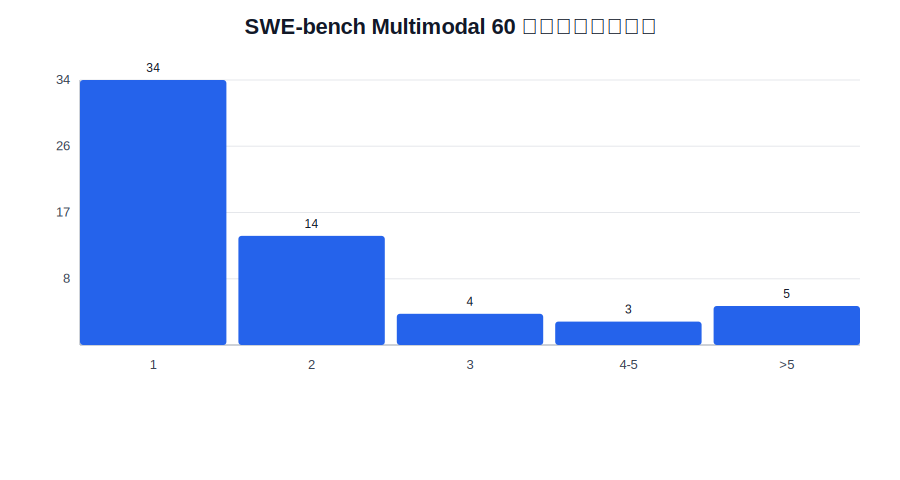
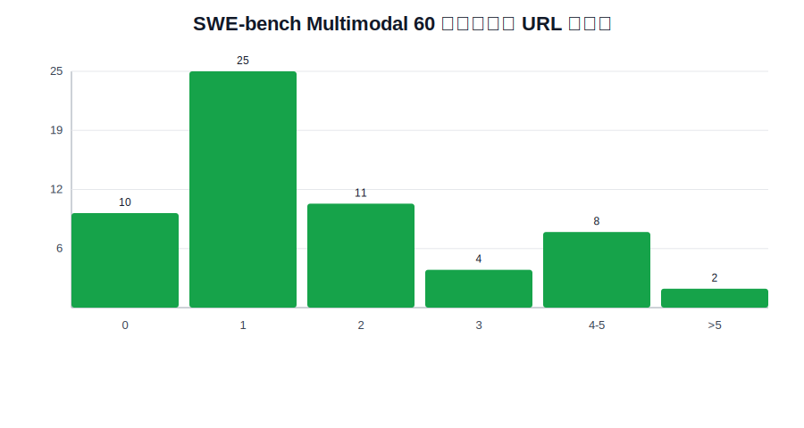
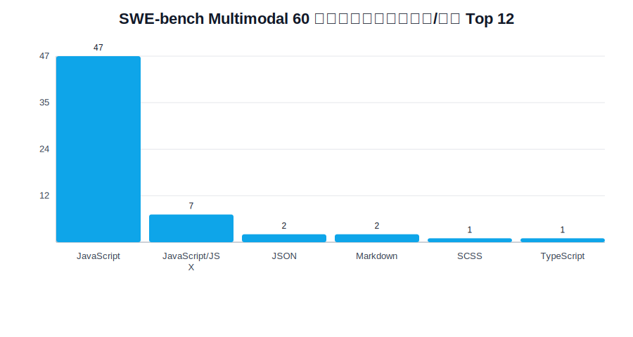
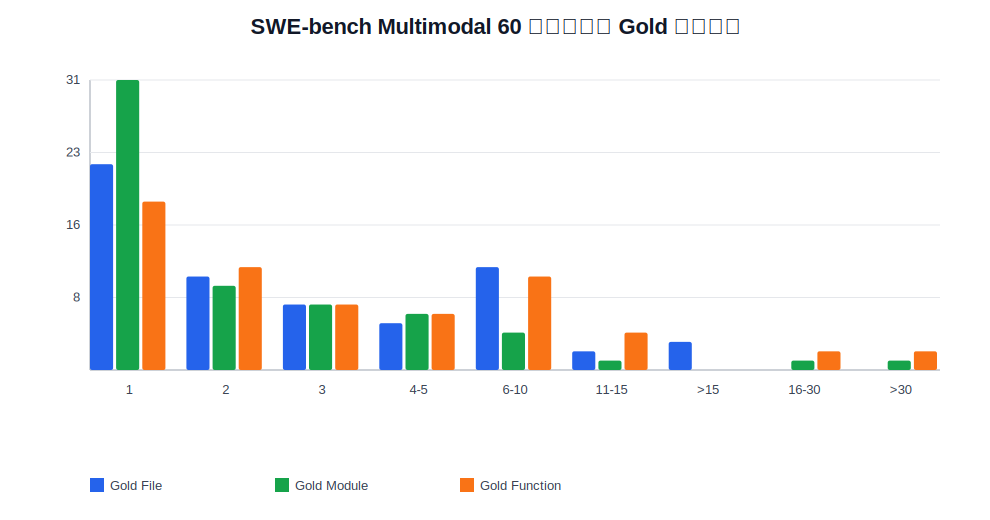

关键分布表：

| 分布项 | 桶 | 样本数 |
|---|---|---|
| 图片数 | 1 | 34 |
| 图片数 | 2 | 14 |
| 图片数 | 3 | 4 |
| 图片数 | 4-5 | 3 |
| 图片数 | >5 | 5 |
| 网页URL数 | 0 | 10 |
| 网页URL数 | 1 | 25 |
| 网页URL数 | 2 | 11 |
| 网页URL数 | 3 | 4 |
| 网页URL数 | 4-5 | 8 |
| 网页URL数 | >5 | 2 |
| Gold文件数 | 1 | 22 |
| Gold文件数 | 2 | 10 |
| Gold文件数 | 3 | 7 |
| Gold文件数 | 4-5 | 5 |
| Gold文件数 | 6-10 | 11 |
| Gold文件数 | 11-15 | 2 |
| Gold文件数 | >15 | 3 |
| Hunk数 | 1 | 13 |
| Hunk数 | 2 | 8 |
| Hunk数 | 3 | 4 |
| Hunk数 | 4-5 | 8 |
| Hunk数 | 6-10 | 9 |
| Hunk数 | 11-15 | 9 |
| Hunk数 | 16-30 | 6 |
| Hunk数 | >30 | 3 |
| Gold Module数 | 1 | 31 |
| Gold Module数 | 2 | 9 |
| Gold Module数 | 3 | 7 |
| Gold Module数 | 4-5 | 6 |
| Gold Module数 | 6-10 | 4 |
| Gold Module数 | 11-15 | 1 |
| Gold Module数 | 16-30 | 1 |
| Gold Module数 | >30 | 1 |
| Gold Function数 | 1 | 18 |
| Gold Function数 | 2 | 11 |
| Gold Function数 | 3 | 7 |
| Gold Function数 | 4-5 | 6 |
| Gold Function数 | 6-10 | 10 |
| Gold Function数 | 11-15 | 4 |
| Gold Function数 | 16-30 | 2 |
| Gold Function数 | >30 | 2 |

模态组合：

| 模态 | 样本数 |
|---|---|
| 图片+网页URL | 50 |
| 仅图片 | 10 |

主修改文件类型/语言 Top：

| 语言 | 样本数 |
|---|---|
| JavaScript | 47 |
| JavaScript/JSX | 7 |
| JSON | 2 |
| Markdown | 2 |
| SCSS | 1 |
| TypeScript | 1 |

主修改文件类型/语言与模态组合交叉分布 Top：

| 语言 | 纯文本 | 仅图片 | 仅网页URL | 图片+网页URL |
|---|---|---|---|---|
| JavaScript | 0 | 7 | 0 | 40 |
| JavaScript/JSX | 0 | 3 | 0 | 4 |
| JSON | 0 | 0 | 0 | 2 |
| Markdown | 0 | 0 | 0 | 2 |
| SCSS | 0 | 0 | 0 | 1 |
| TypeScript | 0 | 0 | 0 | 1 |

长尾样本示例：

| 维度 | 样本 | repo | 值 | 图片 | URL | 文件 | module | function | hunk | 语言 |
|---|---|---|---|---|---|---|---|---|---|---|
| 图片最多 | chartjs__Chart.js-8650 | chartjs/Chart.js | 73 | 73 | 1 | 6 | 6 | 9 | 10 | JavaScript |
| URL最多 | chartjs__Chart.js-8162 | chartjs/Chart.js | 18 | 1 | 18 | 1 | 1 | 1 | 2 | JavaScript |
| 文件最多 | diegomura__react-pdf-1285 | diegomura/react-pdf | 36 | 1 | 1 | 36 | 43 | 121 | 128 | JavaScript |
| 函数最多 | diegomura__react-pdf-1285 | diegomura/react-pdf | 121 | 1 | 1 | 36 | 43 | 121 | 128 | JavaScript |
| hunk最多 | diegomura__react-pdf-1285 | diegomura/react-pdf | 128 | 1 | 1 | 36 | 43 | 121 | 128 | JavaScript |

### 2.3 OmniGIRL full-candidates

当前可运行候选全集口径，不是原始 959 全量；本地通常为 631。

- 样本文件：`MM-IR/data/omnigirl-full-candidates/samples.jsonl`
- 结构文件：`MM-IR/data/omnigirl-full-candidates/repo_structures`
- module/function 可统计样本数：631 / 631

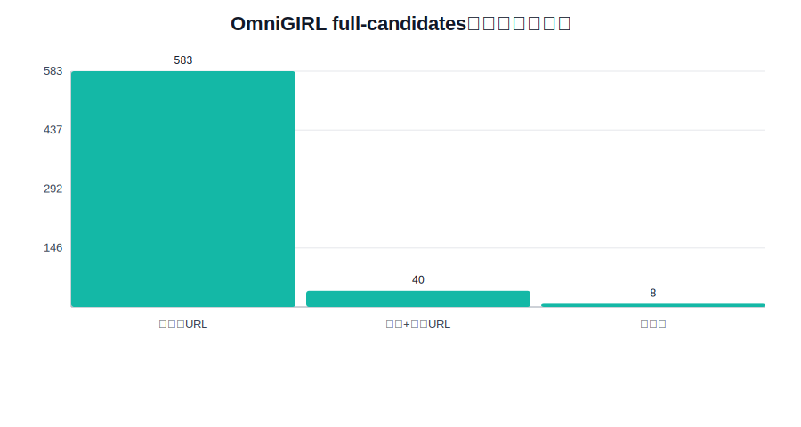

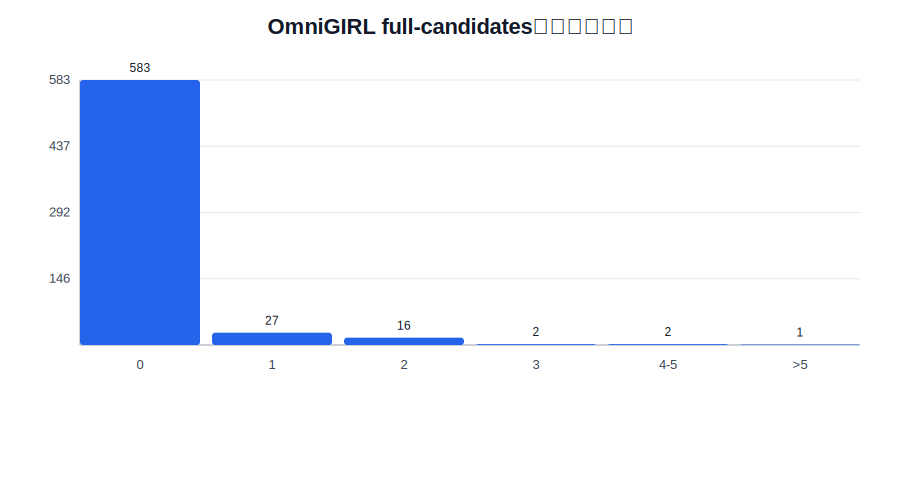
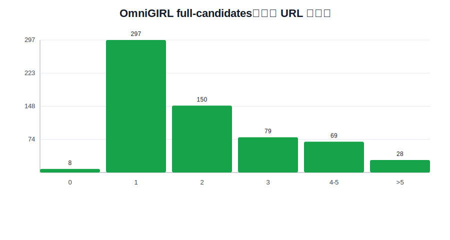
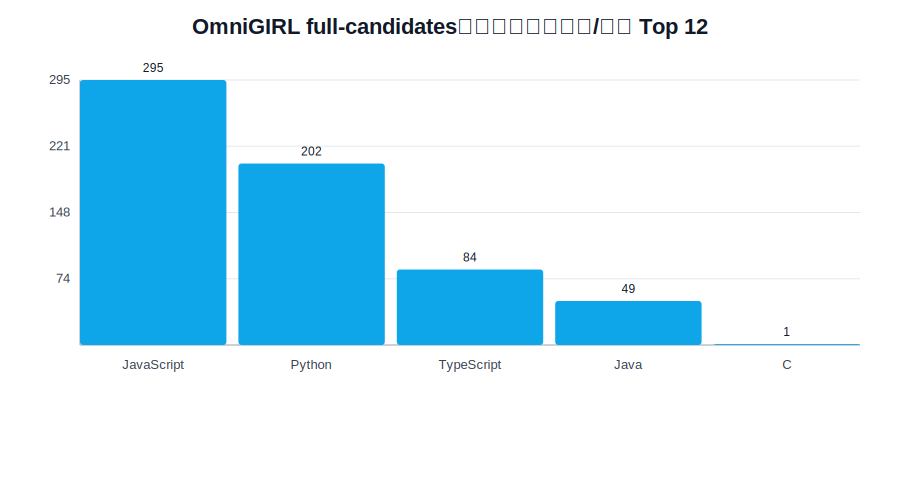
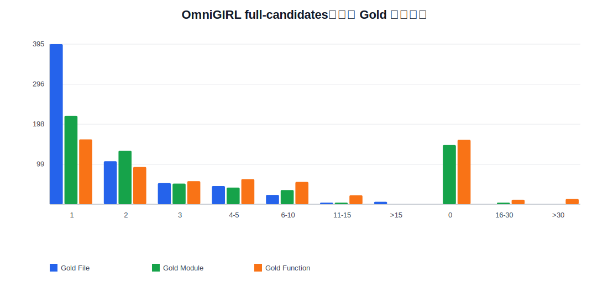

关键分布表：

| 分布项 | 桶 | 样本数 |
|---|---|---|
| 图片数 | 0 | 583 |
| 图片数 | 1 | 27 |
| 图片数 | 2 | 16 |
| 图片数 | 3 | 2 |
| 图片数 | 4-5 | 2 |
| 图片数 | >5 | 1 |
| 网页URL数 | 0 | 8 |
| 网页URL数 | 1 | 297 |
| 网页URL数 | 2 | 150 |
| 网页URL数 | 3 | 79 |
| 网页URL数 | 4-5 | 69 |
| 网页URL数 | >5 | 28 |
| Gold文件数 | 1 | 395 |
| Gold文件数 | 2 | 106 |
| Gold文件数 | 3 | 52 |
| Gold文件数 | 4-5 | 45 |
| Gold文件数 | 6-10 | 23 |
| Gold文件数 | 11-15 | 4 |
| Gold文件数 | >15 | 6 |
| Hunk数 | 1 | 207 |
| Hunk数 | 2 | 128 |
| Hunk数 | 3 | 62 |
| Hunk数 | 4-5 | 84 |
| Hunk数 | 6-10 | 78 |
| Hunk数 | 11-15 | 34 |
| Hunk数 | 16-30 | 27 |
| Hunk数 | >30 | 11 |
| Gold Module数 | 0 | 146 |
| Gold Module数 | 1 | 218 |
| Gold Module数 | 2 | 132 |
| Gold Module数 | 3 | 51 |
| Gold Module数 | 4-5 | 41 |
| Gold Module数 | 6-10 | 35 |
| Gold Module数 | 11-15 | 4 |
| Gold Module数 | 16-30 | 4 |
| Gold Function数 | 0 | 159 |
| Gold Function数 | 1 | 160 |
| Gold Function数 | 2 | 92 |
| Gold Function数 | 3 | 57 |
| Gold Function数 | 4-5 | 62 |
| Gold Function数 | 6-10 | 55 |
| Gold Function数 | 11-15 | 22 |
| Gold Function数 | 16-30 | 11 |
| Gold Function数 | >30 | 13 |

模态组合：

| 模态 | 样本数 |
|---|---|
| 仅网页URL | 583 |
| 图片+网页URL | 40 |
| 仅图片 | 8 |

主修改文件类型/语言 Top：

| 语言 | 样本数 |
|---|---|
| JavaScript | 295 |
| Python | 202 |
| TypeScript | 84 |
| Java | 49 |
| C | 1 |

主修改文件类型/语言与模态组合交叉分布 Top：

| 语言 | 纯文本 | 仅图片 | 仅网页URL | 图片+网页URL |
|---|---|---|---|---|
| JavaScript | 0 | 3 | 262 | 30 |
| Python | 0 | 3 | 192 | 7 |
| TypeScript | 0 | 0 | 81 | 3 |
| Java | 0 | 2 | 47 | 0 |
| C | 0 | 0 | 1 | 0 |

长尾样本示例：

| 维度 | 样本 | repo | 值 | 图片 | URL | 文件 | module | function | hunk | 语言 |
|---|---|---|---|---|---|---|---|---|---|---|
| 图片最多 | prettier__prettier-16347 | prettier/prettier | 6 | 6 | 14 | 1 | 1 | 1 | 2 | JavaScript |
| URL最多 | iamkun__dayjs-858 | iamkun/dayjs | 21 | 0 | 21 | 2 | 0 | 0 | 2 | JavaScript |
| 文件最多 | iamkun__dayjs-1459 | iamkun/dayjs | 27 | 0 | 1 | 27 | 7 | 9 | 37 | JavaScript |
| 函数最多 | webpack__webpack-15579 | webpack/webpack | 100 | 0 | 1 | 16 | 16 | 100 | 49 | JavaScript |
| hunk最多 | babel__babel-16277 | babel/babel | 54 | 0 | 2 | 4 | 0 | 0 | 54 | TypeScript |

### 2.4 OmniGIRL unified60 子集

统一 60 样本子集，用于多 baseline 横向比较。

- 样本文件：`LocAgent/newtest/omnigirl-unified60/data/samples.jsonl`
- 结构文件：`LocAgent/newtest/omnigirl-unified60/repo_structures`
- module/function 可统计样本数：60 / 60

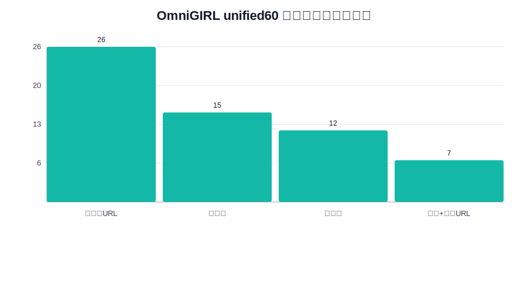

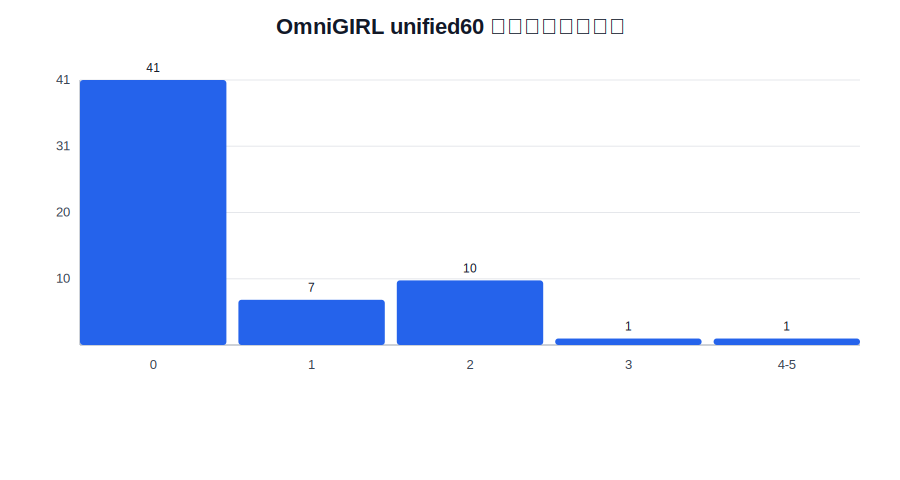
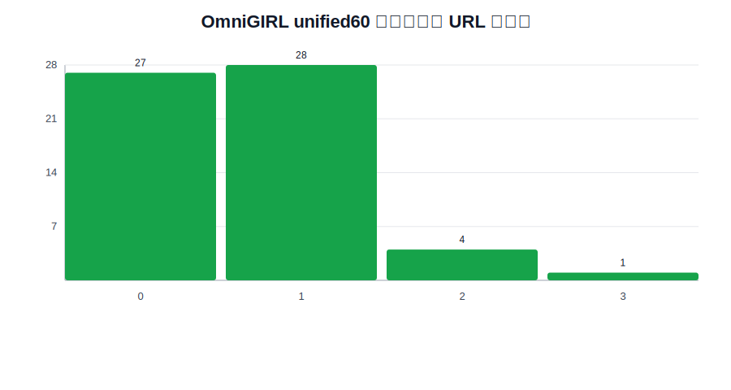
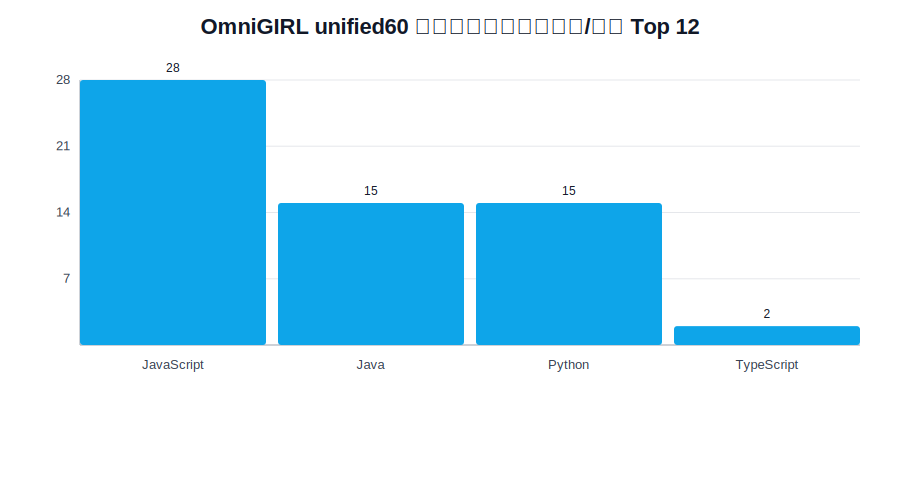
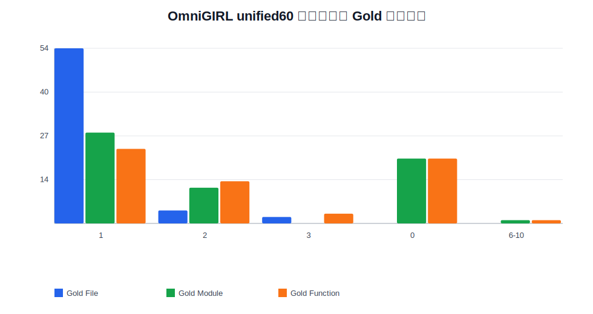

关键分布表：

| 分布项 | 桶 | 样本数 |
|---|---|---|
| 图片数 | 0 | 41 |
| 图片数 | 1 | 7 |
| 图片数 | 2 | 10 |
| 图片数 | 3 | 1 |
| 图片数 | 4-5 | 1 |
| 网页URL数 | 0 | 27 |
| 网页URL数 | 1 | 28 |
| 网页URL数 | 2 | 4 |
| 网页URL数 | 3 | 1 |
| Gold文件数 | 1 | 54 |
| Gold文件数 | 2 | 4 |
| Gold文件数 | 3 | 2 |
| Hunk数 | 1 | 42 |
| Hunk数 | 2 | 12 |
| Hunk数 | 3 | 1 |
| Hunk数 | 4-5 | 3 |
| Hunk数 | 6-10 | 2 |
| Gold Module数 | 0 | 20 |
| Gold Module数 | 1 | 28 |
| Gold Module数 | 2 | 11 |
| Gold Module数 | 6-10 | 1 |
| Gold Function数 | 0 | 20 |
| Gold Function数 | 1 | 23 |
| Gold Function数 | 2 | 13 |
| Gold Function数 | 3 | 3 |
| Gold Function数 | 6-10 | 1 |

模态组合：

| 模态 | 样本数 |
|---|---|
| 仅网页URL | 26 |
| 纯文本 | 15 |
| 仅图片 | 12 |
| 图片+网页URL | 7 |

主修改文件类型/语言 Top：

| 语言 | 样本数 |
|---|---|
| JavaScript | 28 |
| Java | 15 |
| Python | 15 |
| TypeScript | 2 |

主修改文件类型/语言与模态组合交叉分布 Top：

| 语言 | 纯文本 | 仅图片 | 仅网页URL | 图片+网页URL |
|---|---|---|---|---|
| JavaScript | 0 | 10 | 12 | 6 |
| Java | 15 | 0 | 0 | 0 |
| Python | 0 | 2 | 13 | 0 |
| TypeScript | 0 | 0 | 1 | 1 |

长尾样本示例：

| 维度 | 样本 | repo | 值 | 图片 | URL | 文件 | module | function | hunk | 语言 |
|---|---|---|---|---|---|---|---|---|---|---|
| 图片最多 | tailwindlabs__tailwindcss-6469 | tailwindlabs/tailwindcss | 4 | 4 | 0 | 1 | 1 | 2 | 2 | JavaScript |
| URL最多 | prettier__prettier-14701 | prettier/prettier | 3 | 0 | 3 | 1 | 0 | 0 | 1 | JavaScript |
| 文件最多 | tqdm__tqdm-535 | tqdm/tqdm | 3 | 1 | 0 | 3 | 10 | 9 | 8 | Python |
| 函数最多 | tqdm__tqdm-535 | tqdm/tqdm | 9 | 1 | 0 | 3 | 10 | 9 | 8 | Python |
| hunk最多 | tqdm__tqdm-535 | tqdm/tqdm | 8 | 1 | 0 | 3 | 10 | 9 | 8 | Python |

### 2.5 OmniGIRL 原始源数据

原始源数据只能稳定统计图片、URL、语言、文件、hunk 等 patch 级特征；module/function 需要 repo_structures，因此这里不做实体级 gold。

- 样本文件：`MM-IR/data/omnigirl-full-candidates/source_omnigirl_full.jsonl`
- 结构文件：无，因此 module/function gold 不做实体映射统计。

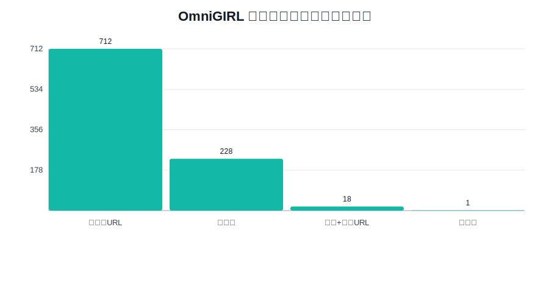

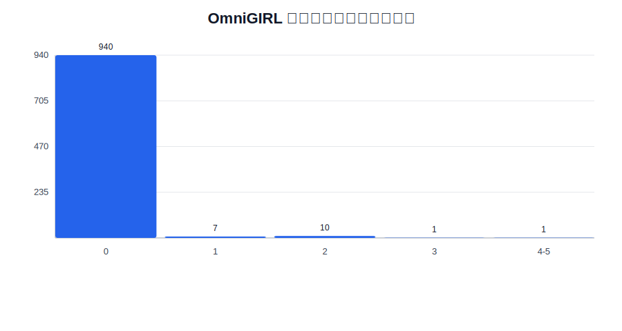
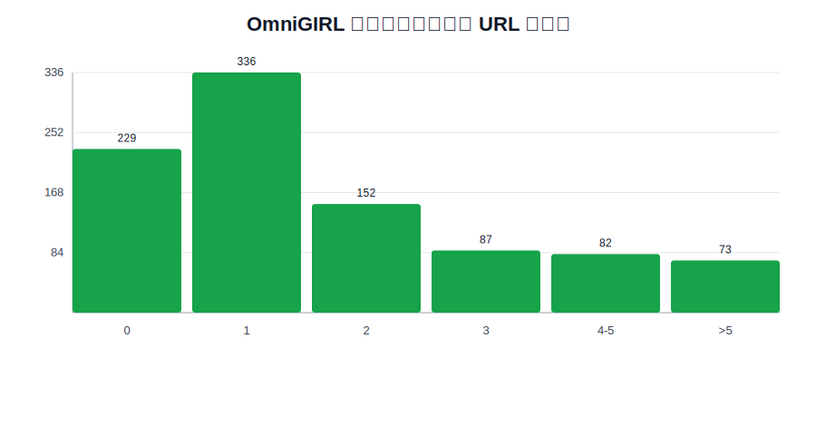
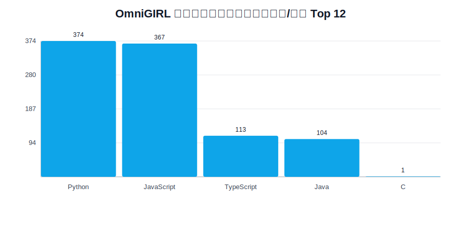
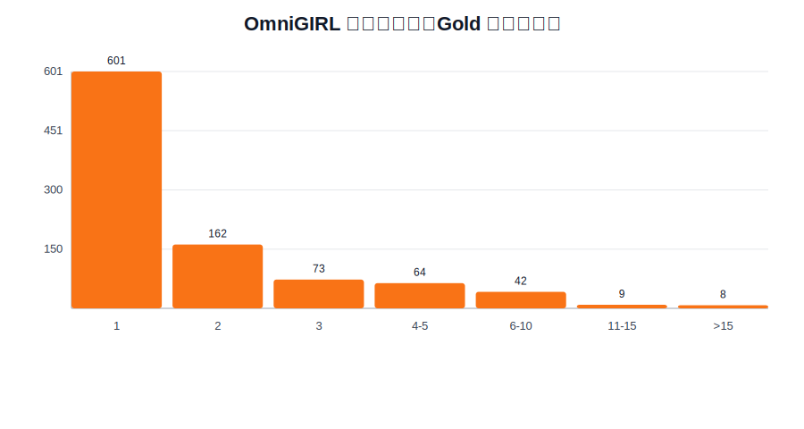

关键分布表：

| 分布项 | 桶 | 样本数 |
|---|---|---|
| 图片数 | 0 | 940 |
| 图片数 | 1 | 7 |
| 图片数 | 2 | 10 |
| 图片数 | 3 | 1 |
| 图片数 | 4-5 | 1 |
| 网页URL数 | 0 | 229 |
| 网页URL数 | 1 | 336 |
| 网页URL数 | 2 | 152 |
| 网页URL数 | 3 | 87 |
| 网页URL数 | 4-5 | 82 |
| 网页URL数 | >5 | 73 |
| Gold文件数 | 1 | 601 |
| Gold文件数 | 2 | 162 |
| Gold文件数 | 3 | 73 |
| Gold文件数 | 4-5 | 64 |
| Gold文件数 | 6-10 | 42 |
| Gold文件数 | 11-15 | 9 |
| Gold文件数 | >15 | 8 |
| Hunk数 | 1 | 314 |
| Hunk数 | 2 | 196 |
| Hunk数 | 3 | 96 |
| Hunk数 | 4-5 | 120 |
| Hunk数 | 6-10 | 116 |
| Hunk数 | 11-15 | 58 |
| Hunk数 | 16-30 | 43 |
| Hunk数 | >30 | 16 |

模态组合：

| 模态 | 样本数 |
|---|---|
| 仅网页URL | 712 |
| 纯文本 | 228 |
| 图片+网页URL | 18 |
| 仅图片 | 1 |

主修改文件类型/语言 Top：

| 语言 | 样本数 |
|---|---|
| Python | 374 |
| JavaScript | 367 |
| TypeScript | 113 |
| Java | 104 |
| C | 1 |

主修改文件类型/语言与模态组合交叉分布 Top：

| 语言 | 纯文本 | 仅图片 | 仅网页URL | 图片+网页URL |
|---|---|---|---|---|
| Python | 130 | 0 | 242 | 2 |
| JavaScript | 47 | 1 | 304 | 15 |
| TypeScript | 9 | 0 | 103 | 1 |
| Java | 42 | 0 | 62 | 0 |
| C | 0 | 0 | 1 | 0 |

长尾样本示例：

| 维度 | 样本 | repo | 值 | 图片 | URL | 文件 | module | function | hunk | 语言 |
|---|---|---|---|---|---|---|---|---|---|---|
| 图片最多 | tailwindlabs__tailwindcss-6469 | tailwindlabs/tailwindcss | 4 | 4 | 6 | 1 | None | None | 2 | JavaScript |
| URL最多 | iamkun__dayjs-858 | iamkun/dayjs | 27 | 0 | 27 | 2 | None | None | 2 | JavaScript |
| 文件最多 | iamkun__dayjs-793 | iamkun/dayjs | 131 | 0 | 0 | 131 | None | None | 136 | JavaScript |
| hunk最多 | iamkun__dayjs-793 | iamkun/dayjs | 136 | 0 | 0 | 131 | None | None | 136 | JavaScript |

## 3. 读数方式和结论

1. **图片数分布**看的是每个 issue/sample 显式携带的 `image_urls` 或等价字段。图片越多，模型需要从视觉证据中提取 bug 线索的概率越高。
2. **网页 URL 数分布**看的是非图片网页链接。脚本会合并 `web_urls`、`website_links`、`website links`、`urls` 等字段并去重；如果这些字段都为空，才从问题描述中兜底抽取网页 URL。
3. **主修改文件类型/语言分布**看的是 gold patch 实际修改的文件类型，不是仓库整体语言。因此 JavaScript 仓库里出现 Markdown、MDX、JSON、SCSS 并不矛盾，它只是说明该样本真实补丁主要改到了这些文件。
4. **Gold 文件数**是实际 patch 涉及的文件数。它能反映 file-level 定位难度，但不能直接代表 function-level 难度。
5. **Gold Module/Function 数**是修改行和结构实体重叠后的实体数量。一个文件可以对应多个函数，也可能完全不映射到函数。
6. **Hunk 数**表示 patch 中分散修改块数量。文件数少但 hunk 多，通常说明修改在同一文件里分布很散，函数级定位仍然可能很难。

总体上，SWE-bench Multimodal 的样本更强调多模态和多位置修改：图片、URL、hunk 和 gold 文件数都更高。OmniGIRL full-candidates 更大、更偏少文件，但语言和仓库更分散，function 数有长尾。OmniGIRL unified60 则是更小、更干净的统一子集，适合快速对比 baseline，但不能代表 OmniGIRL full-candidates 的长尾复杂度。

## 4. 如何重新生成

```bash
cd /home/like/locCode
python3 notes/main/tupian/benchmark_sample_distribution.py
```

生成物：

- `notes/main/tupian/generated/benchmark_sample_distribution_stats.json`：所有原始统计和交叉分布。
- `notes/main/tupian/generated/*.svg`：柱状图。
- `notes/results/006_benchmark样本URL图片语言和Gold分布分析.md`：本文档。
